# Hollowfen - The Failing Village

## Story and Game Design Document

**Working draft:** Full story draft  
**Purpose:** This document is the master narrative outline for the game. It combines story prose, mission design, NPC dialogue, journal updates, unlocks, and implementation notes. The final version should be exportable into an art-book-like PDF while remaining practical enough to build from.

---

## Canon Locks

- **Player character:** Wren Tobin, late 20s, daughter of the late miller Tobin.
- **Primary fantasy rule:** There is no overt magic. The wonder is ecological, inherited, and half-forgotten.
- **Core loop:** Explore, identify mushrooms, forage safely, cook or sell, help villagers, restore Hollowfen.
- **Primary Act I feeling:** Coming home to a place that has nearly given up, then finding one small useful thing that changes the air in the room.
- **Dialogue style:** Rural, brief, subtext-heavy. No faux-medieval theatrical speech. No modern slang.
- **Player experience target:** A functional narrative design document with illustrated chapter passages, final in-game script, and implementation-ready mission beats.

---

# Act I - Arrival

## Act Function

Act I establishes Wren, Hollowfen, the mill, the mushroom journal, the first foraging tutorial, the first sale, and the generational secret. The act should teach the player that the game is not about heroic conquest. It is about careful attention becoming useful.

The player should finish Act I understanding:

- Hollowfen is failing, but not dead.
- Wren has returned because her father is gone and his letters stopped.
- The river Wend changed course and killed the mill.
- The Old Wood is feared by villagers, but Wren can read it differently.
- Mushroom identification is practical, dangerous, emotional, and economically meaningful.
- Wren's family carried forgotten knowledge.
- Sister Almy knows more than she has said.

## Act I Mission Chain

| Order | Quest ID | Mission Title | Story Card | Primary Goal |
|---|---|---|---|---|
| 1 | `arrive` | Homecoming | `homecoming` | Walk into Hollowfen at dusk. |
| 2 | `speakBram` | The Crooked Pintle | `crooked_pintle` | Speak with Bram and receive the mill key. |
| 3 | `searchMill` | Your Father's Mill | `fathers_mill` | Enter the mill and search the house. |
| 4 | `findJournal` | The Hidden Journal | `hidden_journal` | Find Tobin's mushroom journal. |
| 5 | `firstForage` | The First Forage | `first_forage` | Identify three safe basics and one strange gold-stemmed find. |
| 6 | `firstSale` | Marra's Kitchen | `marra_kitchen` | Sell or deliver the first basket to the inn. |
| 7 | `meetAlmy` | A Knock at the Door | `almy_doorway` | Meet Sister Almy and trigger the Act II hook. |

## Act I Systems Introduced

- Basic movement and camera.
- Talk/interact prompt.
- Quest tracker and compass marker.
- Entering interiors or framed interaction zones.
- Inspectable environmental objects.
- Journal UI.
- Mushroom identification tutorial.
- Foraging inventory.
- First sale or delivery.
- Story card unlock.
- Wren journal update.

---

## Scene 1 - Homecoming

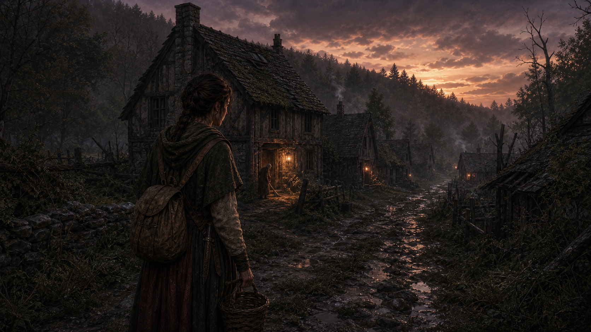

### Scene Purpose

Introduce Wren and Hollowfen through movement, silence, and visible decline. This is the player's first contact with the village. The emotional note is not despair. It is recognition strained through absence.

### Narrative Passage

It had been three years since Wren Tobin walked the east road into Hollowfen.

At first, the valley looked as it always had from the ridge: the low roofs tucked into the hollow, the dark shoulder of the Old Wood behind them, the pale line of the Wend cutting through the fields. Then the road dipped, and the old picture came apart.

The river was wrong.

It ran too far south now, silvering the lower fields where wheat should have stood. The millstream beside the lane was a bed of stones and pale grass. Smoke rose from fewer chimneys than Wren remembered. Two cottages near the well had boards nailed over their windows. A third had no door at all, only a grey blanket tacked across the frame and moving in the evening wind.

She shifted the pack on her shoulder and kept walking.

The village did not greet her. No children ran the lane. No cart rattled down from the Slatemoor road. Somewhere a shutter knocked once, then again, then stopped. The air smelled of damp thatch, cold ash, and the first green rot of autumn.

At the inn, a man was sweeping the same three leaves across the same patch of threshold without improving either one. He was broader in Wren's memory. Louder too. Old Bram had once laughed from the bar so hard that mugs trembled. Now he leaned on the broom as if it had become a third leg.

He looked up when her boots struck the packed earth of the square. For half a breath he did not know her. Then his face changed.

Wren stopped beside the well, with the old inn sign creaking beyond him.

"Old Bram! How I've missed you. It's been so long. I thought of the Pintle every winter in Veyrwick - your fire, Marra's oatcakes, Dad pretending not to notice when I stayed past supper."

Bram took one step forward, then stopped himself, as if unsure whether a girl who had gone away might still be hugged by a man who had known her as a child. His eyes went to her face, her pack, the knife at her belt, and back to her face.

"Wren? Lord help me, it is you. Come here and let an old innkeeper look at you. Three winters, and you've come home with your father's height and your mother's eyes. I only wish the village had kept more of itself to welcome you."

That was Bram: the man who had once laughed hard enough to tremble every mug in the Pintle, trying to make room for grief by speaking around it.

### Gameplay Mission

**Mission title:** Homecoming  
**Quest ID:** `arrive`  
**Location:** East road into Hollowfen and the village well

**Player goal:** Walk into Hollowfen and approach Bram.

### Objectives

- Follow the road into Hollowfen.
- Observe the village square.
- Approach Old Bram beside the village well.

### Player-Facing Quest Text

**Quest received:** Homecoming  
**Objective:** Walk the road into Hollowfen and find someone who remembers you.

### Environmental Beats

- The player begins just outside the village at dusk.
- The first visible landmarks are the dead millstream, boarded cottages, village well, inn, and dark line of the Old Wood.
- The mill should be visible in the distance but not yet reachable as an active objective.
- Several cottages should have unlit windows to establish failure without dialogue.

### Required Dialogue

**Dialogue ID:** `act1.homecoming.bram.recognition`

| Speaker | Line |
|---|---|
| Wren | "Old Bram! How I've missed you. It's been so long. I thought of the Pintle every winter in Veyrwick - your fire, Marra's oatcakes, Dad pretending not to notice when I stayed past supper." |
| Bram | "Wren? Lord help me, it is you. Come here and let an old innkeeper look at you. Three winters, and you've come home with your father's height and your mother's eyes. I only wish the village had kept more of itself to welcome you." |

### Optional Ambient Lines

These should only trigger after Bram recognizes Wren, and only from unnamed villagers at a distance.

| Speaker | Line |
|---|---|
| Villager | "That's Tobin's girl, then." |
| Villager | "Thought she stayed in Veyrwick." |
| Villager | "No one comes back from Veyrwick." |

### Story Card Unlock

Unlock `homecoming` when the player enters the village square or completes the approach to Bram.

### Implementation Notes

- This scene can be mostly on rails or lightly guided.
- Do not overload the player with UI yet. Let the road, village, and Bram carry the opening.
- The first quest marker should be subtle and diegetic if possible: lantern glow at the well, Bram sweeping, or a compass label reading "Old Bram."

---

## Scene 2 - The Crooked Pintle

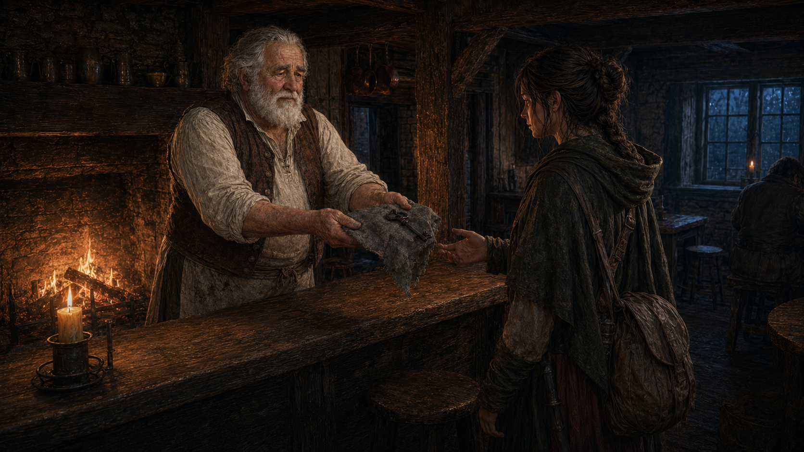

### Scene Purpose

Give the player the first real conversation, the mill key, and the first explanation of what happened to the village. Bram is warm but defeated. He should make the player feel welcome and guilty in the same breath.

### Narrative Passage

The well stood between them and The Crooked Pintle, its windows half-lit against the dusk. Bram's broom lay forgotten in the road. He kept one hand inside his coat, closed around something he had carried too long.

"Dad's letters grew shorter, then stopped," Wren said. "He wrote about the flooded fields, never how bad it was. I should have come sooner, Bram. Tell me what happened - and why you have the mill key."

Bram drew out a grey rag folded around something small. The key inside was iron, black with age, the bow worn smooth where generations of Tobins had turned it in their fingers.

"Your father made every hardship sound like weather. The Wend changed course three winters ago and left the wheel over dry stones. When he took poorly, he brought me this key and asked me to keep the damp out until you came home. I did what I could. He was a good man, Wren, and a dear friend. I am sorry."

There it was. The thing everyone would say because there was no useful thing to say instead. But Bram had given it weight: three winters of turning the key in his pocket, walking the mill lane, and waiting beside the well.

Wren closed her fingers around the iron.

"Thank you for keeping faith with him. I'll take the key now - and whatever waits at the mill. I've spent long enough being absent."

### Gameplay Mission

**Mission title:** The Crooked Pintle  
**Quest ID:** `speakBram`  
**Location:** Village well, within sight of The Crooked Pintle

**Player goal:** Speak to Bram and receive the mill key.

### Objectives

- Speak with Old Bram beside the well.
- Receive the mill key.
- Leave for Tobin's mill.

### Player-Facing Quest Text

**Quest updated:** The Crooked Pintle  
**Objective:** Bram has your father's key. Speak with him at the well.

### Required Dialogue

**Dialogue ID:** `act1.crooked_pintle.bram.key`

| Speaker | Line |
|---|---|
| Wren | "Dad's letters grew shorter, then stopped. He wrote about the flooded fields, never how bad it was. I should have come sooner, Bram. Tell me what happened - and why you have the mill key." |
| Bram | "Your father made every hardship sound like weather. The Wend changed course three winters ago and left the wheel over dry stones. When he took poorly, he brought me this key and asked me to keep the damp out until you came home. I did what I could. He was a good man, Wren, and a dear friend. I am sorry." |
| Wren | "Thank you for keeping faith with him. I'll take the key now - and whatever waits at the mill. I've spent long enough being absent." |

### Optional Follow-Up Dialogue

Available if the player talks to Bram again before leaving.

**Dialogue ID:** `act1.crooked_pintle.bram.repeat`

| Speaker | Line |
|---|---|
| Bram | "Mill lane runs east from the well. You'll know the turn. Of course you will - old habit, Wren. Forgive me." |

### Item Acquired

**Item:** Mill key  
**Internal ID:** `item.mill_key`  
**Use:** Unlocks Tobin's mill and begins `searchMill`.

### Story Card Unlock

Unlock `crooked_pintle` when Bram gives Wren the key.

### Implementation Notes

- Bram should not overexplain the village collapse. The player should leave with two facts: the Wend changed course, and the mill died with it.
- Bram's introduction should establish three things without extra turns: he has kept the Pintle since Wren's childhood, he loved her parents, and he apologizes when he is helpless.

---

## Scene 3 - Your Father's Mill

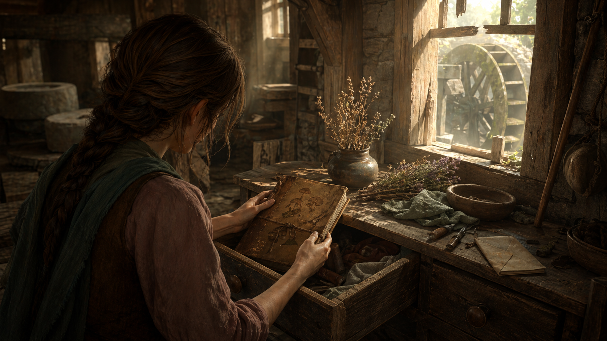

### Scene Purpose

Turn the mill into Wren's home base and make absence tangible. The scene should invite inspection. The player is not solving a puzzle yet. They are entering a room where someone stopped living.

### Narrative Passage

The mill key stuck on the first turn.

Wren had to lift the door by the latch, shoulder it gently, and turn the key again before the lock gave. The sound went through her like a cough in an empty church.

Inside, the air was cold and dry with old flour.

The mill had not been abandoned in a hurry. That made it worse. Tobin's boots stood under the bench, toes aligned. His coat hung on the peg nearest the hearth. The kettle sat black-bellied on the cold stones, tilted as if someone had meant to fill it and lost the thought halfway across the room.

Wren set her pack beside the table.

The house answered with the small sounds of settling timber.

She moved through the room as carefully as if her father were asleep upstairs. A stack of ledgers lay on the long table, each tied with cord. A spoon had been left in a bowl. Three onion skins curled near the cutting board, paper-thin and brown as old letters. On the mantel, her mother's blue cup stood where it always had, though one side had cracked and been mended with yellow glue.

Outside the back window, the mill wheel hung over the dead streambed.

Wren stood there a long time.

When she was small, the wheel had filled the house with sound. It had spoken through the walls and floorboards, a low wooden turning that made sleep easy. Now there was only wind in the dry grass below it.

She took off her cloak. Folded it once. Then unfolded it because there was no reason to be tidy for a dead man and every reason.

"All right, Dad," she said to the room.

The room said nothing back.

### Gameplay Mission

**Mission title:** Your Father's Mill  
**Quest ID:** `searchMill`  
**Location:** Tobin's mill exterior and interior  
**Player goal:** Enter the mill, inspect key objects, and find the path toward the hidden journal.

### Objectives

- Follow the lane to Tobin's mill.
- Unlock the mill door.
- Inspect the kitchen, hearth, table, and mill wheel.
- Search for anything Tobin left behind.

### Player-Facing Quest Text

**Quest updated:** Your Father's Mill  
**Objective:** Go to the old mill and look for what your father left behind.

### Required Interactables

| Interactable ID | Object | Player Text |
|---|---|---|
| `mill.door` | Front door | "The key is stiff, but it turns." |
| `mill.coat` | Tobin's coat | "Father's coat. Still on the same peg." |
| `mill.kettle` | Hearth kettle | "Empty. Soot-black. Waiting." |
| `mill.ledger_stack` | Ledgers | "Accounts, tied and dated. His hand stayed neat to the end." |
| `mill.window_wheel` | Window facing wheel | "The wheel hangs over a bed of stones. No water reaches it now." |
| `mill.drawer_hint` | Lower chest drawer | "This drawer sits crooked in the frame." |

### Required Dialogue / Wren Barks

Wren is alone, so these are quiet spoken lines or internal subtitle lines.

**Dialogue ID:** `act1.fathers_mill.wren.inspect`

| Trigger | Wren Line |
|---|---|
| Entering mill | "It smells the same." |
| Inspecting coat | "You never hung it there unless you meant to go out again." |
| Inspecting ledgers | "Still tidy. Of course you were." |
| Inspecting wheel | "No wonder the letters got shorter." |
| Finding drawer hint | "That was never loose before." |

### Story Card Unlock

Unlock `fathers_mill` when the player enters the mill interior.

### Implementation Notes

- Let this scene breathe. It should be the first slow interior.
- The player should have optional inspection, but the critical path should gently lead toward the bottom drawer.
- The hidden journal should not be immediately glowing or gamified. Use framing, dust, or a slight camera/interaction prompt.

---

## Scene 4 - The Hidden Journal

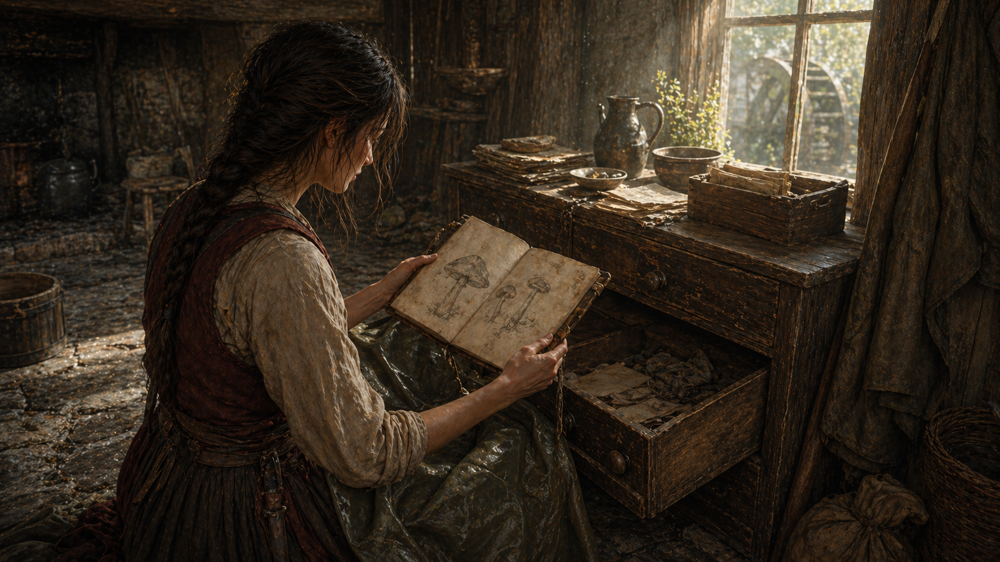

### Scene Purpose

Reveal the mushroom journal and connect story inheritance to the core identification mechanic. This is where the player learns that foraging is not random collecting. It is knowledge, caution, and family history.

### Narrative Passage

The bottom drawer opened only halfway.

Wren pulled once, felt it catch, then set her shoulder against the chest and eased it forward by inches. Something inside scraped against the wood. Not a tool. Not crockery. Paper.

She reached into the gap and found oilcloth.

The bundle was tied with butcher's string, the knot dark where fingers had worried it over and over. Wren knew her father's knots. This one had been tied in hesitation.

She sat on the stone floor and untied it.

The journal inside was brown leather, soft at the corners, its cover marked by rain and thumb oil. No title. No name. Only a small pressed line at the lower edge where a clasp had once been and broken off.

The first pages were recipes in her mother's hand.

Wren stopped breathing for a moment.

Then Tobin's writing began.

Field Cap. Wood Ear. Pinecrest.

Each entry had a careful pencil sketch and notes in the margins. Cap shape. Gills. Stem. Where found. What not to trust. A line under one warning so hard the pencil had torn the paper: never eat what you cannot name twice.

Wren turned the pages faster.

Goldfoot. Lacewig. Bonepale. Names she half-remembered from childhood songs, from kitchen talk, from her mother humming over a pot. Some pages were full. Some held only a name. Some had been left blank except for pressed spores that had stained the paper like old smoke.

At the back, under a folded receipt from the mill, Tobin had written in a different hand. Not different letters. A different man.

If you're reading this, I never told you.

The forest was always our family's secret. Your grandmother knew. Your mother knew. I was waiting until you were old enough.

I am sorry I waited too long.

- Dad

Wren held the page open until the light shifted on the floor.

Then she closed the book, opened it again, and began at the first entry.

### Gameplay Mission

**Mission title:** The Hidden Journal  
**Quest ID:** `findJournal`  
**Location:** Tobin's mill interior  
**Player goal:** Find the journal and complete the first journal tutorial.

### Objectives

- Open the lower drawer.
- Unwrap the oilcloth bundle.
- Read Tobin's note.
- Open the Field Guide tab.
- Review the first three complete mushroom entries: Field Cap, Wood Ear, Pinecrest.
- Notice an unfinished margin note for Goldfoot.

### Player-Facing Quest Text

**Quest updated:** The Hidden Journal  
**Objective:** Read your father's journal and learn the first three mushrooms.

### Required Journal Entries Unlocked

| Mushroom ID | Common Name | Lesson |
|---|---|---|
| `fieldCap` | Field Cap | Habitat and pattern matter. |
| `woodEar` | Wood Ear | Not every useful mushroom has a cap and stem. |
| `pinecrest` | Pinecrest | Turn mushrooms over. Pores and gills are different. |
| `goldfoot_partial` | Goldfoot, unfinished note | Some knowledge is inherited as fragments before it becomes a full entry. |

### Required Dialogue / Journal Script

**Dialogue ID:** `act1.hidden_journal.tobin_note`

| Speaker | Line |
|---|---|
| Wren's narration | "It was no mill ledger. The worn book was a field journal, wrapped in oilcloth to survive the damp." |
| Wren's narration | "Part recipe book, part mushroom guide, part family record. Her mother's recipes came first; then her father's hand: Field Cap. Wood Ear. Pinecrest." |
| Wren's narration | "Each entry recorded cap, gills, stem, where it grew, how to prepare it, and what could kill a careless forager. Under one warning, the pencil had torn the page: Never eat what you cannot name twice." |
| Wren's narration | "At the back, the field notes gave way to a letter: If you're reading this, I never told you." |
| Tobin's journal | "The forest was always our family's secret. Your grandmother knew. Your mother knew. I was waiting until you were old enough." |
| Tobin's journal | "I am sorry I waited too long. - Dad" |
| Wren | "Dad." |

### Tutorial Text

Keep tutorial text short and in-world.

| UI Moment | Text |
|---|---|
| Journal opens | "Tobin's journal has been added to your pack." |
| First ID lesson | "A safe harvest starts with a name. Compare cap, gills, stem, habitat, and season before picking." |
| Warning | "If you cannot identify a mushroom, leave it." |

### Story Card Unlock

Unlock `hidden_journal` when the player opens the journal.

### Implementation Notes

- The journal should become a major UI object after this scene.
- Tobin's note should be replayable from the journal.
- This is the first moment the player sees a hard rule: identification before harvesting.
- The final blank-page painting carries Tobin's farewell as live localized text, including his "Dad" sign-off; reveal its paragraphs on narration beats 3, 4, and 5 so the writing and spoken/subtitle copy stay synchronized. Do not bake one language into the art.

---

## Scene 5 - The First Forage

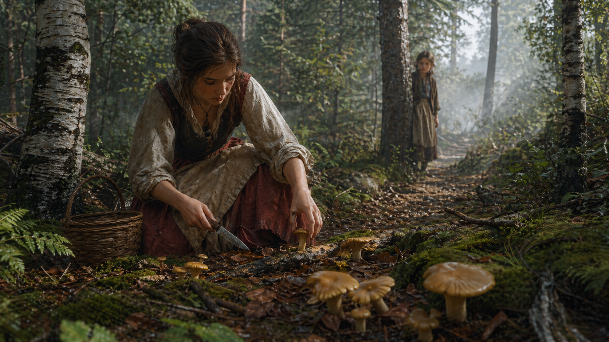

### Scene Purpose

Teach identification through a quiet walk into the Edge Woods. Introduce Edda without explaining her. The forest should feel feared by the village but not hostile to Wren.

### Narrative Passage

Morning came pale and cold.

Wren slept badly in the loft and woke to a village rooster that sounded offended to still be alive. She made tea from leaves gone stale in her father's tin, drank half, and packed the journal with more care than she packed food.

The Edge Woods began where the last garden wall gave up.

Villagers had always spoken of the trees as if they were a mouth. Stay out of the Old Wood. Don't follow lights. Don't eat what grows where no one planted. As a child, Wren had believed them because children believe the shape fear takes when adults hand it down.

Now she stepped under birch shade and found damp leaves, pine needles, fallen branches, and the soft ticking of last night's rain.

The first Field Caps grew in a ring through short grass near the path. She nearly missed them because they looked so ordinary. Small tan caps. Wiry stems. Pale gills set wide apart underneath. The journal lay open on her knee while she checked each one.

Name it twice, she thought.

Field Cap by the ring. Field Cap by the stem.

The Wood Ear was easier once she stopped looking for a cap. It clung to a fallen branch like a folded scrap of brown leather, rubbery under her fingertip. Pinecrest took longer. Three brown caps under pine duff, two wrong, one right. She turned it over and found pores instead of gills.

Only then did she cut it.

The gold-stemmed ones were not in the first pages.

Wren found them where the moss grew deep under a leaning spruce: small brown caps, yellow hollow stems, forked ridges running down instead of true gills. The journal had only a margin note for them, half a sketch beside a recipe in her mother's hand. Goldfoot, perhaps. Good in broth. False ones nearby.

She crouched there longer than she had with the others.

Name it twice, her father had written.

Goldfoot by the hollow stem. Goldfoot by the forked ridges. Not the brown-gilled little things growing two handspans away. Not the brittle stems. Not the ones that seemed eager to be mistaken.

She cut only three.

When she stood, a girl was watching from the path.

Fourteen, perhaps. Thin from a hard year, brown smock, basket hooked over one arm and nothing in it. She had the look of someone deciding whether to run and deciding not to give anyone the satisfaction.

"You're not afraid of in there," the girl said.

Wren looked back into the trees.

"I might be," she said. "I'm being polite about it."

The girl considered that.

"Most folk are."

"Most folk don't have my father's book."

The girl's eyes moved to the journal, then to the basket.

"Edda," she said, as if the name had been pulled from her.

"Wren."

"I know."

Then Edda turned and walked back toward the village, leaving Wren alone with a careful basket and the strange feeling that she had passed a test no one had explained.

### Gameplay Mission

**Mission title:** The First Forage  
**Quest ID:** `firstForage`  
**Location:** Edge Woods  
**Player goal:** Correctly identify and collect one each of Field Cap, Wood Ear, and Pinecrest, then make a careful Goldfoot discovery.

### Objectives

- Go to the Edge Woods.
- Find a Field Cap growing in short grass.
- Find a Wood Ear growing on dead wood.
- Find a Pinecrest beneath pine trees.
- Find a small Goldfoot cluster growing in moss beside dangerous lookalikes.
- Inspect each mushroom before harvesting.
- Return with a safe first basket.

### Player-Facing Quest Text

**Quest updated:** The First Forage  
**Objective:** Use your father's journal to identify three safe mushrooms in the Edge Woods. Trust the margin notes carefully if you find anything stranger.

### Identification Tutorial

| Step | Prompt |
|---|---|
| Approach mushroom | "Inspect before picking." |
| Inspect cap | "Cap shape and color are clues, not proof." |
| Inspect underside | "Check gills, pores, or folds." |
| Inspect habitat | "Where it grows matters." |
| Confirm ID | "Name it twice before cutting." |
| Harvest | "Cut cleanly. Leave the base and the small ones." |

### Required Dialogue

Edda appears after the third correct harvest, or after the first correct harvest if the pacing needs an earlier human beat.

**Dialogue ID:** `act1.first_forage.edda.first_meeting`

| Speaker | Line |
|---|---|
| Edda | "You're not afraid of in there." |
| Wren | "I might be. I'm being polite about it." |
| Edda | "Most folk are." |
| Wren | "Most folk don't have my father's book." |
| Edda | "Edda." |
| Wren | "Wren." |
| Edda | "I know." |

### Optional Edda Repeat Lines

If the player approaches Edda before completing all three mushrooms:

| Speaker | Line |
|---|---|
| Edda | "That one's wrong." |
| Wren | "Which one?" |
| Edda | "The one your hand's nearest." |

Alternate:

| Speaker | Line |
|---|---|
| Edda | "Grandfather says the wood keeps what it wants." |
| Wren | "And what do you say?" |
| Edda | "I don't know yet." |

### Items Acquired

- `mushroom.fieldCap`
- `mushroom.woodEar`
- `mushroom.pinecrest`
- `mushroom.goldfoot_sample`

### Story Card Unlock

Unlock `first_forage` after the player successfully identifies and harvests the first safe mushroom.

### Implementation Notes

- The player should be able to misidentify visually, but Act I should prevent lethal consequences. Wrong picks can trigger Wren hesitation or journal warnings.
- Use Edda sparingly. Her silence is part of her introduction.
- This scene teaches that the forest is legible, not magical.

---

## Scene 6 - Marra's Kitchen

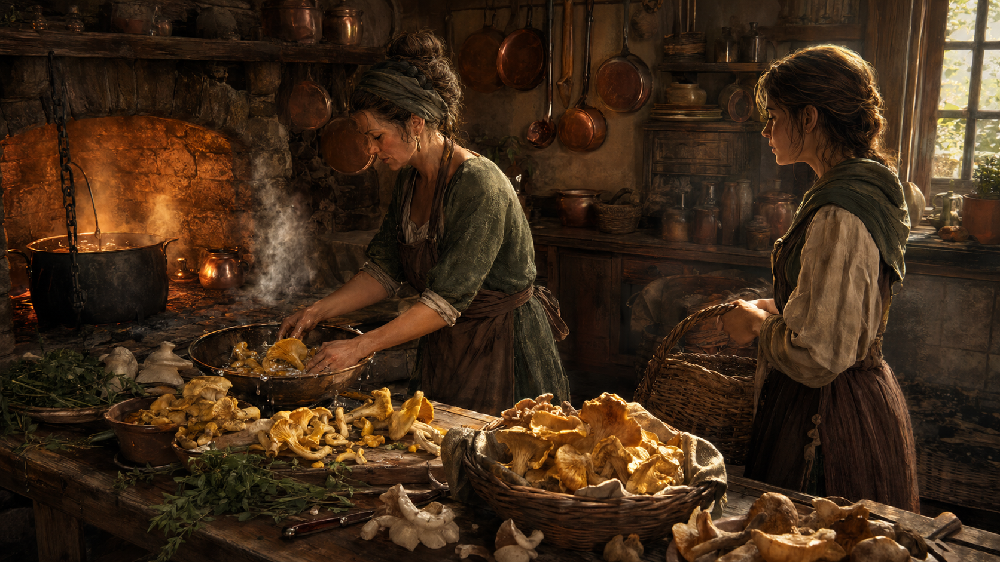

### Scene Purpose

Complete the first core loop: forage becomes food, food becomes coin, coin becomes hope. Bram reacts emotionally. Marra reacts practically. The player should feel that one basket matters.

### Narrative Passage

Bram was wiping the same mug when Wren came through the inn door.

It was possible he had been wiping it since yesterday.

He looked up, opened his mouth to ask the ordinary question, and saw the basket.

The cloth inside was damp from the woods. Wren folded it back.

For a moment the common room held still.

"Field Caps," Bram said. "Wood Ear." His voice changed on the third. "Pinecrest."

Wren set the basket on the bar.

Then Bram saw the three small gold-stemmed mushrooms tucked in the corner of the cloth.

"Marra," he said.

"Are they worth anything?"

Bram made a sound that was not quite a laugh.

From the kitchen came the hard chop of a knife stopping mid-stroke.

"What?"

"Come here."

"If the roof's fallen in, stand somewhere else."

"Marra."

She came through the kitchen door with her sleeves rolled and flour on one forearm. She looked at Bram first, annoyed by his tone, then at Wren, then at the basket.

Her face did not soften. That would have been too easy.

"Where did you get those?"

"Edge Woods."

"You picked them yourself?"

"I checked them against Father's journal. Mostly."

Marra reached into the basket, lifted one of the gold-stemmed mushrooms, turned it, smelled it, and set it down with more care than she had picked it up.

"Goldfoots," Marra said.

Bram put both hands on the bar.

"In this kitchen," he said. "After twenty years."

"Cold water," she said.

Wren blinked.

"What?"

"You wash these in cold water. Not hot. Hot bruises them and makes liars of the texture. I'll tell you twice and not three times."

Bram looked at Wren over Marra's shoulder. His eyes shone.

"Do for what?"

"Stew."

An hour later, the inn smelled like Wren's mother.

Not exactly. Nothing was exact after enough years. But the steam rising from Marra's pot carried pepper, onion, woodsmoke, and the dark silk smell of mushrooms opening in broth. Two men came in from the lane and stayed. Then one woman. Then Elder Pell, who claimed he had only come to ask Bram about a hinge and left with a bowl in both hands.

Bram counted three silver and two copper into Wren's palm.

"First proper bowl we've sold in a month," he said.

The coins were not heavy. They felt heavy.

### Gameplay Mission

**Mission title:** Marra's Kitchen  
**Quest ID:** `firstSale`  
**Location:** The Crooked Pintle  
**Player goal:** Bring the first basket to Bram and Marra, unlock cooking/selling, receive first payment.

### Objectives

- Return to The Crooked Pintle.
- Show Bram the basket.
- Let Marra inspect the mushrooms.
- Help wash or prepare the mushrooms.
- Receive first coin.
- Unlock basic selling and kitchen commission systems.

### Player-Facing Quest Text

**Quest updated:** Marra's Kitchen  
**Objective:** Bring your first basket to The Crooked Pintle and see if Hollowfen still has an appetite.

### Required Dialogue

**Dialogue ID:** `act1.marra_kitchen.first_basket`

| Speaker | Line |
|---|---|
| Bram | "Field Caps. Wood Ear." |
| Bram | "Pinecrest." |
| Bram | "Marra." |
| Wren | "Are they worth anything?" |
| Marra | "What?" |
| Bram | "Come here." |
| Marra | "If the roof's fallen in, stand somewhere else." |
| Bram | "Marra." |
| Marra | "Where did you get those?" |
| Wren | "Edge Woods." |
| Marra | "You picked them yourself?" |
| Wren | "I checked them against Father's journal. Mostly." |
| Marra | "Goldfoots." |
| Bram | "In this kitchen. After twenty years." |
| Marra | "Cold water." |
| Wren | "What?" |
| Marra | "You wash these in cold water. Not hot. Hot bruises them and makes liars of the texture." |
| Marra | "I'll tell you twice and not three times." |

### Payment Dialogue

**Dialogue ID:** `act1.marra_kitchen.first_payment`

| Speaker | Line |
|---|---|
| Bram | "Three silver, two copper." |
| Wren | "That much?" |
| Bram | "First proper bowl we've sold in a month." |
| Marra | "Don't look grateful. Bring better ones next time." |
| Wren | "That is gratitude, from you." |
| Marra | "Careful." |

### Optional Ambient Lines

| Speaker | Line |
|---|---|
| Villager | "Haven't smelled that since Tobin's wife was alive." |
| Villager | "Is Marra cooking again?" |
| Pell | "Put me down for one bowl. No, not in the ledger. In a bowl." |

### Rewards and Unlocks

- Coin: `3 silver, 2 copper` or economy-adjusted equivalent.
- Unlock: Basic sell interface with Bram.
- Unlock: Basic cooking commission interface with Marra.
- Unlock: Recipe `field_stew_basic` or `edge_woods_stew`.
- Relationship: Bram +10, Marra +5, Village Hope +5.

### Story Card Unlock

Unlock `marra_kitchen` when Marra accepts the mushrooms.

### Implementation Notes

- This should be the first visible proof that the player's actions change the village.
- If possible, add small world-state change after completion: one or two villagers in the inn, more firelight, a pot on the hearth.
- Marra should not become warm too quickly. Her respect begins as standards.

---

## Scene 7 - A Knock at the Door

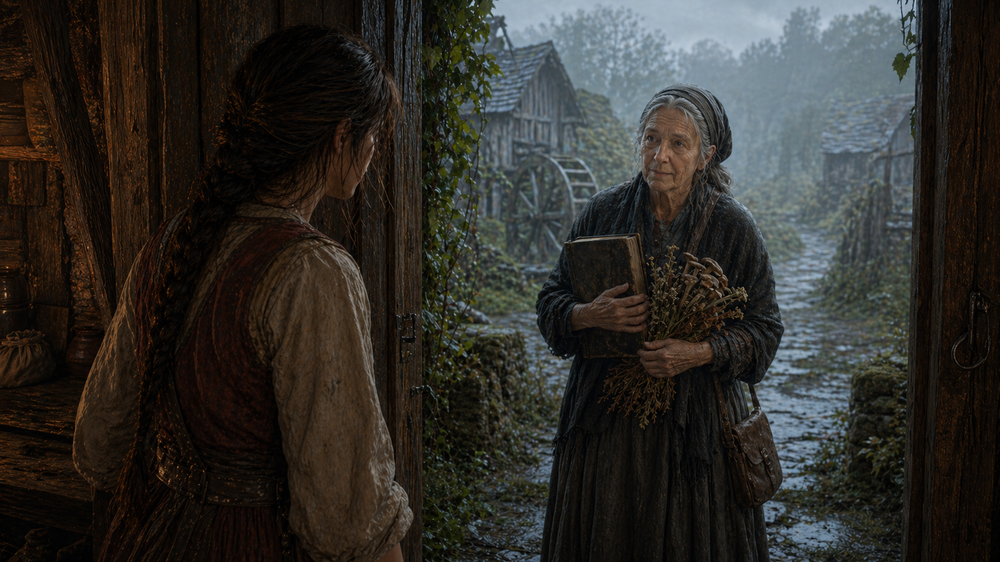

### Scene Purpose

End Act I with the generational hook. Sister Almy confirms that Wren's knowledge is not only Tobin's secret; it belongs to a severed village lineage. This scene opens cultivation, old lore, and Act II.

### Narrative Passage

Someone knocked on the mill door before sunrise.

Wren woke with her hand already reaching for the knife beside the bed. For a moment she did not know where she was. The loft rafters. The cold. The smell of flour and old smoke. Home, then.

The knock came again.

Not Bram. Bram would have called through the door and apologized for waking her before he finished doing it. Not Marra, who would have knocked once and entered on principle.

Wren pulled on her overdress, tied her hair back with yesterday's ribbon, and climbed down the ladder.

Sister Almy stood on the threshold with a leather satchel over one shoulder and a bundle of dried stems tied in red thread. She was smaller than Wren remembered and more difficult to look away from. Her grey hair was tucked under a plain kerchief. Soil marked the edge of one sleeve.

"Good morning," Wren said.

"No," said Almy.

Wren waited.

Almy looked past her into the kitchen, to the table where Tobin's journal lay closed beside the cold teacup.

"You picked goldfoots yesterday."

"Field Caps. Wood Ear. Pinecrest."

"And goldfoots."

Wren said nothing.

Almy's mouth pressed thin.

"You picked the true ones and left the false ones beside them."

"I used my father's journal."

"Your father couldn't have taught you that. He didn't know it."

The words landed harder than Wren expected.

Almy stepped inside without asking, then stopped just far enough over the threshold to make it clear she knew she had been rude and had chosen it anyway.

"Your grandmother taught me three things," she said. "She forbade me from teaching anyone else."

Wren's hand tightened on the door.

"I don't remember my grandmother."

"No. But your hands do."

Outside, morning gathered slowly over the dry millstream.

Almy nodded toward the kitchen table.

"Sit down, child. We need to talk about your grandmother."

### Gameplay Mission

**Mission title:** A Knock at the Door  
**Quest ID:** `meetAlmy`  
**Location:** Tobin's mill doorway and kitchen  
**Player goal:** Speak with Sister Almy and complete Act I.

### Objectives

- Return to the mill after the first sale.
- Sleep or trigger next morning.
- Answer the knock at the door.
- Speak with Sister Almy.
- Begin the Act II cultivation thread.

### Player-Facing Quest Text

**Quest updated:** A Knock at the Door  
**Objective:** Sister Almy has come to the mill. Hear what she knows about your grandmother.

### Required Dialogue

**Dialogue ID:** `act1.almy_doorway.first_visit`

| Speaker | Line |
|---|---|
| Wren | "Good morning." |
| Almy | "No." |
| Wren | "No?" |
| Almy | "You picked goldfoots yesterday." |
| Wren | "Field Caps. Wood Ear. Pinecrest." |
| Almy | "And goldfoots." |
| Wren | "I used my father's journal." |
| Almy | "Your father couldn't have taught you that. He didn't know it." |
| Wren | "Then who did?" |
| Almy | "Your grandmother taught me three things." |
| Almy | "She forbade me from teaching anyone else." |
| Wren | "I don't remember my grandmother." |
| Almy | "No. But your hands do." |
| Almy | "Sit down, child. We need to talk about your grandmother." |

### Act Break Journal Update

**Journal ID:** `journal.act1.complete`

"Bram gave me the key. Father's house is colder than I remembered. His journal was hidden in the bottom drawer, wrapped like a thing that could still be protected. I found Field Caps, Wood Ear, Pinecrest, and three Goldfoots I was not entirely brave enough to name until Marra did. This morning Sister Almy came to the door and said my grandmother's name like a key turning. I do not know what opens next."

### Rewards and Unlocks

- Unlock: Act II mission `almyTeach`.
- Unlock: Cultivation tutorial pending.
- Unlock: Relationship tracking for Sister Almy.
- Unlock: Village Hope score if not already visible internally.
- Unlock: Story Card `almy_doorway`.

### Story Card Unlock

Unlock `almy_doorway` when Almy says: "We need to talk about your grandmother."

### Implementation Notes

- This is the Act I closing hook and should feel like a title-card moment.
- Good place for a save prompt, chapter transition, or "Act II - Building" reveal.
- If the game uses day transitions, this scene should trigger the morning after `firstSale`.

---

# Act I Completion State

By the end of Act I, the player has:

- Returned to Hollowfen.
- Received the mill key from Bram.
- Entered Tobin's mill.
- Found the hidden mushroom journal.
- Learned three Tier 1 mushrooms.
- Discovered a partial Goldfoot clue that Marra confirms in the kitchen.
- Completed the first identification and harvest tutorial.
- Met Edda.
- Delivered the first basket to Bram and Marra.
- Earned the first coin.
- Seen the inn become briefly alive again.
- Met Sister Almy.
- Learned that Wren's grandmother is tied to the old foraging knowledge.

## Act I Flags

| Flag | Set When |
|---|---|
| `act1_started` | Player enters Hollowfen road sequence. |
| `homecoming_seen` | Homecoming card unlocks. |
| `mill_key_received` | Bram gives Wren the mill key. |
| `mill_entered` | Wren enters Tobin's mill. |
| `journal_found` | Wren finds Tobin's journal. |
| `field_cap_known` | Field Cap entry unlocks. |
| `wood_ear_known` | Wood Ear entry unlocks. |
| `pinecrest_known` | Pinecrest entry unlocks. |
| `goldfoot_partial_known` | Wren sees Tobin's unfinished Goldfoot margin note. |
| `goldfoot_sample_harvested` | Wren safely cuts the first Goldfoot sample. |
| `first_safe_harvest_complete` | Player harvests first correctly identified mushroom. |
| `edda_met` | Edda introduction dialogue completes. |
| `first_sale_complete` | Marra accepts the basket. |
| `basic_selling_unlocked` | Bram pays Wren. |
| `basic_cooking_unlocked` | Marra's first recipe unlocks. |
| `almy_met` | Almy doorway dialogue completes. |
| `act1_complete` | Act II hook unlocks. |

## Relationship Changes

| NPC | Change | Reason |
|---|---:|---|
| Bram | +10 | Wren returns and brings useful food. |
| Marra | +5 | Wren proves she can identify and handle ingredients. |
| Edda | +3 | Edda sees Wren enter the woods safely. |
| Almy | +5 | Almy recognizes Wren's inherited knowledge. |
| Village Hope | +5 | The inn serves a real mushroom stew again. |

## Act I Production Priorities

1. Make Hollowfen's failure visible before anyone explains it.
2. Make the mill feel like a home base, not only a quest location.
3. Make mushroom identification feel careful and tactile.
4. Keep dialogue short enough for gameplay, but emotionally specific.
5. Use the story cards as chapter rewards and PDF illustrations.
6. End with Almy, not with a menu unlock. The system unlock matters because the story does.

---

# Act II - Building

## Act Function

Act II turns the first spark of usefulness into a village economy. Wren is no longer only grieving in her father's house; she is becoming a person other people plan around. The act introduces cultivation, tool upgrades, recurring trade, tax pressure, medicinal mushrooms, and the first visible signs that Hollowfen can recover.

The player should finish Act II understanding:

- Mushroom knowledge can become a livelihood.
- Hollowfen's recovery is practical, not symbolic.
- The village is watching Wren and beginning to change behavior because of her.
- External pressure still exists through Master Voss and Lord Aldric's taxes.
- The Old Wood contains deeper knowledge than Tobin's first pages.
- Hollin's arrival marks the turn from recovery story into mystery story.

## Act II Mission Chain

| Order | Quest ID | Mission Title | Story Card | Primary Goal |
|---|---|---|---|---|
| 8 | `almyTeach` | The Vine-Tender's Lessons | `almy_lessons` | Learn cultivation from Sister Almy. |
| 9 | `forgeKnife` | Joren's Forge | `jorens_forge` | Commission a proper foraging knife. |
| 10 | `firstTax` | Twelve Silver by Yule | `voss_first_visit` | Help the Wenmar family meet Voss's tax demand. |
| 11 | `theoTrade` | The Trader's Ledger | `theo_trade` | Establish trade with Theo. |
| 12 | `edsGrandfather` | Brightspore at the Bedside | `edda_grandfather` | Forage Brightspore and make a tonic for Edda's grandfather. |
| 13 | `meetHollin` | A Stranger at the Inn | `hollin_arrives` | Meet Hollin and begin the deep-wood mystery. |
| 14 | `cottagesReopen` | Two Boards Come Down | `cottages_reopen` | Complete enough village support tasks to reopen cottages. |
| 15 | `caldenWarning` | Father Calden's Doubt | `caldens_doubt` | Hear Calden's private warning and lose chapel garden access. |

## Act II Systems Introduced

- Cultivation beds and growth timers.
- Tool upgrade gating through Joren.
- Tax deadlines and village consequence states.
- Theo's trade prices and weekly wagon cycle.
- Medicinal mushroom recipes.
- Relationship thresholds.
- Visible village restoration state.
- Suspicion/conscience pressure through Father Calden.

---

## Scene 1 - The Vine-Tender's Lessons

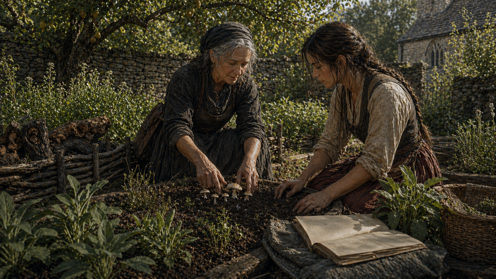

### Scene Purpose

Turn Almy from omen into teacher. This scene unlocks cultivation and makes clear that Wren has inherited a broken chain, not a complete gift.

### Narrative Passage

Almy's garden sat behind the chapel wall where the morning sun reached late and left early.

Wren had passed the gate a hundred times as a child and never seen what grew behind it. Raised beds lay in orderly rows: sage, comfrey, mugwort, onions, three things Wren could not name, and a low wattle frame stacked with damp logs. Almy did not explain the garden as a tour. She pointed, named, corrected, and expected Wren to keep up.

"Your grandmother taught me three things," Almy said, kneeling beside a soaked elder log. "How to read rot. How to feed it. How to leave enough behind."

Wren crouched beside her with Tobin's journal open on a folded cloth. The pages looked younger in Almy's garden, less like relic and more like a tool waiting for dirt.

"Why teach me now?" Wren asked.

Almy pressed her thumb into the log until water welled dark around the bark.

"Because you came back," she said. "Nobody else has, in twenty-six years."

By noon, Wren had cut her first plug, packed it into the wood, sealed it with wax, and understood that cultivation was not farming in miniature. It was a bargain with decay. It was patience made visible.

### Gameplay Mission

**Mission title:** The Vine-Tender's Lessons  
**Quest ID:** `almyTeach`  
**Location:** Chapel garden exterior or Almy's back garden  
**Player goal:** Learn cultivation and plant the first Wood Ear log.

### Objectives

- Meet Sister Almy in her garden.
- Gather or receive damp elder logs.
- Prepare the log with Almy's instructions.
- Inoculate the log with Wood Ear spawn.
- Place the log in Wren's mill yard.

### Required Dialogue

| Speaker | Line |
|---|---|
| Almy | "Your grandmother taught me three things. How to read rot. How to feed it. How to leave enough behind." |
| Wren | "That sounds less like a lesson and more like a warning." |
| Almy | "Most useful lessons are." |
| Wren | "Why teach me now?" |
| Almy | "Because you came back. Nobody else has, in twenty-six years." |
| Almy | "Do not rush growth. Rushed mushrooms teach regret." |

### Rewards and Unlocks

- Unlock: cultivation bed/log placement.
- Unlock: `woodEar_cultivation`.
- Unlock: Almy relationship tier 1.
- Add objective marker to Wren's mill yard.

---

## Scene 2 - Joren's Forge

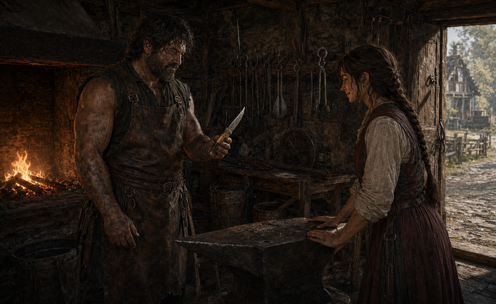

### Scene Purpose

Introduce Joren and the tool upgrade loop. Joren's respect should feel earned by specificity: Wren is not asking for a pretty knife, but the right edge for careful work.

### Narrative Passage

The forge was lit, but only just.

Joren stood in the doorway with blackened forearms and the expression of a man interrupted during an argument with the world. Behind him, the anvil waited under a skin of dust. A smith with no commissions kept his fire low. Hollowfen had taught him economy in humiliating ways.

"You want a foraging knife," he said.

"Yes."

"From me."

"If you still make knives."

That earned her one look sharp enough to cut twine.

Wren put three coins on the workbench and Tobin's old kitchen knife beside them. Its blade was too broad, the handle split, the edge worn wrong from years of onions and bone.

"I need something thin," she said. "Curved enough to cut clean at the base. Strong enough for bracket fungus. Easy to wipe. Not pretty."

Joren looked at the knife again. Then at her hands.

"Come back tomorrow," he said. "And don't tell anyone you commissioned it like charity."

The next morning the new knife lay on his anvil, horn-handled, dark-backed, and better than she had asked for.

### Gameplay Mission

**Mission title:** Joren's Forge  
**Quest ID:** `forgeKnife`  
**Location:** Smithy  
**Player goal:** Commission and receive a proper foraging knife.

### Objectives

- Visit Joren at the smithy.
- Bring coin and Tobin's old kitchen knife.
- Choose the foraging knife upgrade.
- Return the next day.
- Equip the horn-handled foraging knife.

### Required Dialogue

| Speaker | Line |
|---|---|
| Joren | "You want a foraging knife. From me." |
| Wren | "If you still make knives." |
| Joren | "Careful." |
| Wren | "Thin blade. Curved. Strong enough for brackets. Not pretty." |
| Joren | "Pretty costs extra and cuts worse." |
| Joren | "Come back tomorrow. And don't tell anyone you commissioned it like charity." |
| Wren | "I paid." |
| Joren | "I know what I said." |

### Rewards and Unlocks

- Unlock: `tool.foraging_knife_1`.
- Unlock: harvest of bracket fungi and tougher mushrooms.
- Joren relationship +8.

---

## Scene 3 - Twelve Silver by Yule

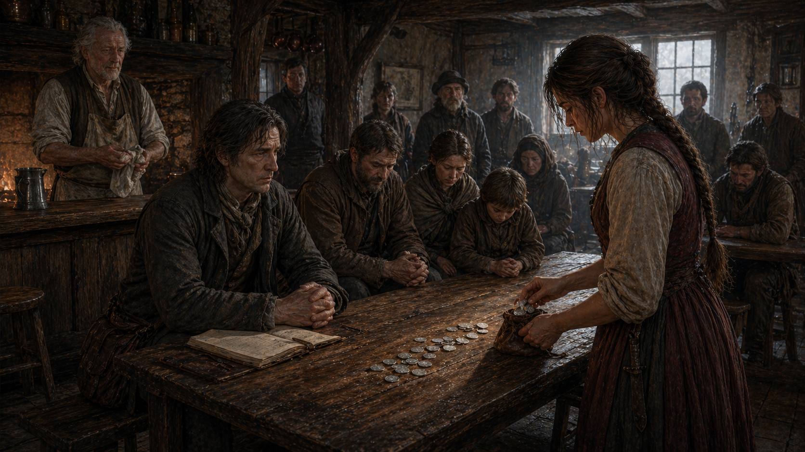

### Scene Purpose

Introduce the tax pressure and make the economy morally urgent. This is the first time Wren's earnings save a specific family rather than generally helping the inn.

### Narrative Passage

Master Voss arrived in a clean coat on a muddy road.

That was the first thing Wren disliked about him. Hollowfen marked everyone who entered it: wet hems, road dust, smoke in the hair. Voss sat in The Crooked Pintle with dry cuffs, a small ledger, and the patience of a locked door.

"His Lordship requires twelve silver from this village," he said. "I am aware your fields have not yielded. I am not unsympathetic, but I am also not paid to be sympathetic."

The Wenmar family sat on the bench nearest the hearth. No fire had been lit. Their son looked at his boots as if memorizing them before they were taken too.

Wren counted her coins twice in her pocket. Mushroom money. Knife money. Roof money. Money that already belonged to three futures she had not named.

Then she put it on the table.

Voss counted more slowly than he needed to.

"This is not the village's account," he said.

"It is today."

Voss looked at her for the first time as if she were not part of the furniture.

"Very well, Miss Tobin."

The Wenmar woman covered her mouth. Bram turned away before anyone could see his face.

### Gameplay Mission

**Mission title:** Twelve Silver by Yule  
**Quest ID:** `firstTax`  
**Location:** The Crooked Pintle  
**Player goal:** Earn enough coin through foraging/cooking/trade to help pay the Wenmar family's tax.

### Objectives

- Hear Voss's demand at the inn.
- Learn the tax deadline.
- Earn or contribute the required amount.
- Return to Voss before sundown.
- Prevent the Wenmar cottage from being seized.

### Required Dialogue

| Speaker | Line |
|---|---|
| Voss | "His Lordship requires twelve silver from this village." |
| Voss | "I am aware your fields have not yielded. I am not unsympathetic, but I am also not paid to be sympathetic." |
| Wren | "Whose property is named?" |
| Voss | "The Wenmar cottage, if payment is not made by sundown." |
| Wren | "Then wait." |
| Voss | "I was already doing so." |
| Voss | "This is not the village's account." |
| Wren | "It is today." |

### Rewards and Unlocks

- Village Hope +10.
- Wenmar cottage remains occupied.
- Voss notice flag: `voss_notices_wren`.
- Unlock recurring tax pressure system.

---

## Scene 4 - The Trader's Ledger

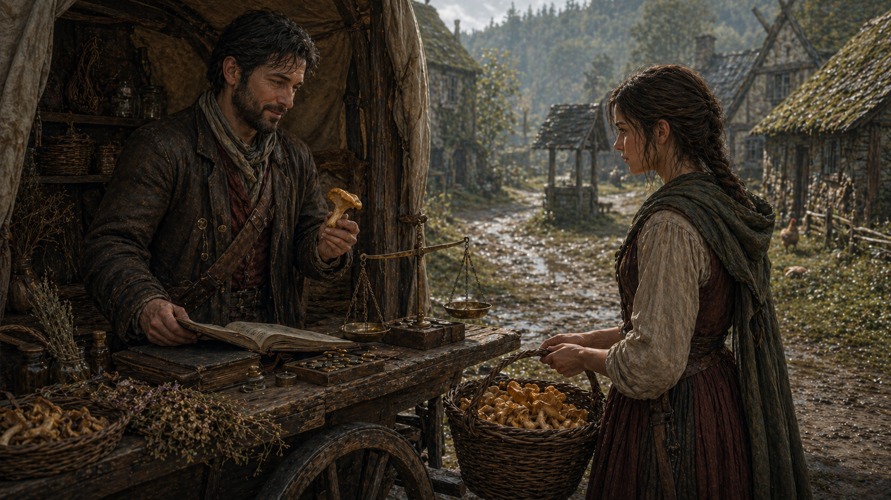

### Scene Purpose

Introduce Theo as the wider world's face. He is useful, charming, and dangerous because his offer of expansion is not false.

### Narrative Passage

Theo's wagon arrived every five to seven days, depending on rain, road, and profit.

He came into Hollowfen smiling as if the village were doing better than it was. That was his trade, Wren thought: not lying, exactly, but letting people stand inside the better version of themselves long enough to buy something.

He opened his ledger on the wagon board and examined the Goldfoots without touching them.

"Where did you find these?"

Wren said nothing.

Theo's smile changed shape.

"Good. Don't answer that too quickly. A secret is worth less every time it leaves your mouth."

He paid more than Bram could, less than the Capital would, and told her both facts plainly. That was the cleverness of him. He cheated by being honest in the places dishonest men would have hidden.

"Anything else you find that looks like it shouldn't be here, I want first refusal," he said. "Don't sell to peddlers. They'll cheat you, and I won't."

"That sounds like something a cheat would say."

"It is. I am saying it with better boots."

### Gameplay Mission

**Mission title:** The Trader's Ledger  
**Quest ID:** `theoTrade`  
**Location:** Village edge or market square  
**Player goal:** Sell a valuable mushroom lot to Theo and unlock market pricing.

### Objectives

- Meet Theo at his wagon.
- Show him Goldfoots or another Tier 2 specimen.
- Review price differences between Hollowfen, Veyrwick, and the Capital.
- Complete the first Theo sale.
- Unlock his wagon schedule.

### Required Dialogue

| Speaker | Line |
|---|---|
| Theo | "Goldfoot. Where did you find these?" |
| Wren | "Near trees." |
| Theo | "Cruel answer. I respect it." |
| Theo | "Anything else you find that looks like it shouldn't be here, I want first refusal." |
| Wren | "Why?" |
| Theo | "Because I can sell it better than you can." |
| Wren | "Honest." |
| Theo | "When it saves time." |

### Rewards and Unlocks

- Unlock: Theo trade interface.
- Unlock: weekly wagon arrival.
- Unlock: market price notes in journal.
- Theo relationship +8.

---

## Scene 5 - Brightspore at the Bedside

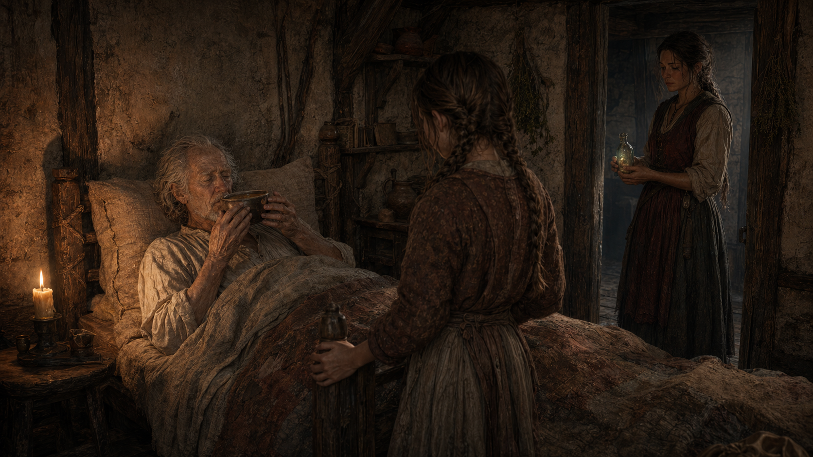

### Scene Purpose

Make the recovery personal. Edda's grandfather is the first named life saved by mushroom knowledge.

### Narrative Passage

Edda did not ask for help as if she expected to receive it.

She stood outside the mill at dusk with both hands on an empty basket and said, "Grandfather hasn't eaten since Monday."

The Brightspore grew where Almy said it might, at the foot of one old birch on ground soft enough to remember water. It was not beautiful in the way market mushrooms were beautiful. It was lacquered, bitter-smelling, and faintly bright at the edge, like firelight seen through horn.

Marra made the broth. Almy measured the shavings. Wren carried the bottle.

Edda's grandfather took half a spoon the first night and frowned as if insulted by being alive. On the second evening he drank a bowl of soup, the whole bowl, and held it afterward with both hands.

"Tastes like when I was small," he said.

Edda stood at the foot of the bed and did not cry. She looked, instead, as if the world had done something rude by becoming possible.

At the door she said, "He ate today."

Wren nodded.

"The whole bowl," Edda said.

There was no answer large enough for that, so Wren only said, "Good."

### Gameplay Mission

**Mission title:** Brightspore at the Bedside  
**Quest ID:** `edsGrandfather`  
**Location:** Edge Woods, inn kitchen, Edda's cottage  
**Player goal:** Find Brightspore, prepare tonic, and deliver it.

### Objectives

- Speak with Edda.
- Ask Almy about medicinal mushrooms.
- Find Brightspore near the old birch.
- Bring Brightspore to Marra or Almy for preparation.
- Deliver tonic to Edda's grandfather.
- Return the next day to check on him.

### Required Dialogue

| Speaker | Line |
|---|---|
| Edda | "Grandfather hasn't eaten since Monday." |
| Wren | "Why tell me?" |
| Edda | "You go where people don't." |
| Almy | "Brightspore is medicine, not supper. Take one. Leave two." |
| Marra | "Bitter things keep people alive more often than sweet ones." |
| Edda | "He ate today. The whole bowl." |
| Wren | "Good." |
| Edda | "That is not a big enough word." |
| Wren | "No." |

### Rewards and Unlocks

- Unlock: medicinal recipes.
- Edda relationship +15.
- Almy relationship +8.
- Village Hope +10.
- Unlock: Edda delivery tasks.

---

## Scene 6 - A Stranger at the Inn

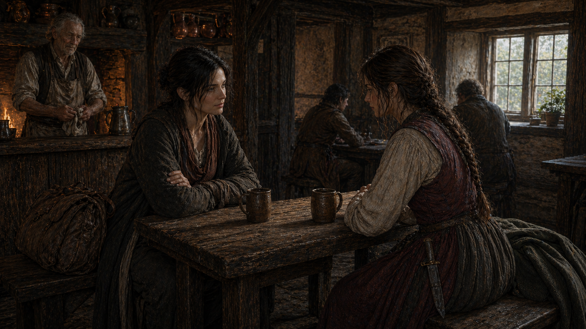

### Scene Purpose

Introduce Hollin as recognition before explanation. Her arrival should feel quiet, not dramatic.

### Narrative Passage

Hollin sat near the inn window with both hands around a clay mug she had not drunk from.

Bram said she had asked for the goldfoot girl by name. Marra said that was not a name and put her to peeling onions until Wren arrived.

The stranger was Wren's age or near it, pale from travel, dark-haired, slight, with a satchel that had been mended by someone careful and not skilled. She looked at Wren once and did not look away too quickly. That, more than anything, made Wren sit.

"I asked at three villages before someone said your name," Hollin said.

"Are you buying?"

"No."

"Selling?"

"No."

The silence after that was easier than it should have been.

Hollin looked toward the window, where the Edge Woods made a dark line above the village roofs.

"I am walking," she said at last. "And looking for a place my grandmother used to name when she thought no one was listening."

Wren felt the table become very still between them.

"What place?"

Hollin's fingers tightened around the mug.

"Not yet."

### Gameplay Mission

**Mission title:** A Stranger at the Inn  
**Quest ID:** `meetHollin`  
**Location:** The Crooked Pintle  
**Player goal:** Meet Hollin and unlock her trust arc.

### Objectives

- Hear from Bram that a stranger asked for Wren.
- Sit with Hollin at the inn.
- Complete the first conversation.
- Ask Bram or Almy optional follow-up questions.

### Required Dialogue

| Speaker | Line |
|---|---|
| Hollin | "I asked at three villages before someone said your name." |
| Wren | "Are you buying?" |
| Hollin | "No." |
| Wren | "Selling?" |
| Hollin | "No." |
| Hollin | "I am walking. And looking for a place my grandmother used to name when she thought no one was listening." |
| Wren | "What place?" |
| Hollin | "Not yet." |

### Rewards and Unlocks

- Unlock: Hollin relationship/trust score.
- Unlock: Deep Wood rumor chain.
- Bram optional line about travelers asking after Wren.

---

## Scene 7 - Two Boards Come Down

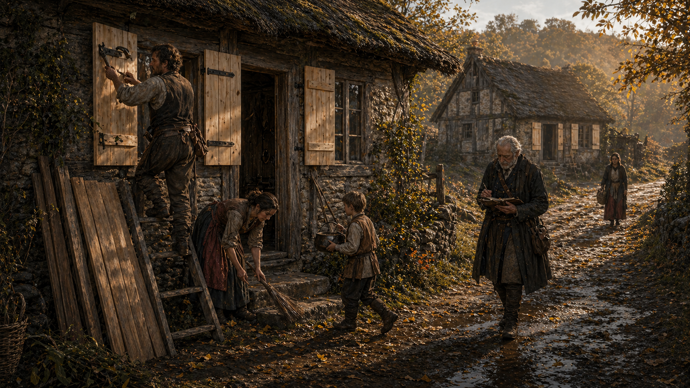

### Scene Purpose

Show visible recovery. The village changes physically because of the player's missions.

### Narrative Passage

By the autumn equinox, two boarded cottages had shutters again.

The first came down from the Wenmar house. Joren made the hinges and complained about the old nails until someone reminded him he was being paid. The second was a smaller cottage on the north lane, empty since the second blight. A cousin from Veyrwick arrived with two children, one pot, and a rooster in a sack.

Elder Pell stood in the square with his ledger open.

"Do you write every shutter?" Wren asked.

"No," he said. "Only the ones that mean something."

The village did not celebrate. Hollowfen had learned caution too well for that. But Marra made extra bread. Bram swept the inn step properly. Edda carried water to the reopened house without being asked. Smoke rose from a chimney that had been cold for three winters.

Pell wrote one line in pencil.

Then, after a long moment, he traced it in ink.

### Gameplay Mission

**Mission title:** Two Boards Come Down  
**Quest ID:** `cottagesReopen`  
**Location:** Village square and cottage lane  
**Player goal:** Complete enough recovery tasks for two cottages to reopen.

### Objectives

- Complete `firstTax`.
- Complete at least two village support tasks.
- Provide coin or materials for shutters.
- Speak with Elder Pell.
- Watch the cottage world-state update.

### Required Dialogue

| Speaker | Line |
|---|---|
| Pell | "Do not look pleased yet. One shutter is not a village." |
| Wren | "Two shutters?" |
| Pell | "Two shutters is a sentence beginning." |
| Joren | "Old nails. Rotten frame. No one respects hinges until they fail." |
| Marra | "If folk are moving in, they'll need bread. Don't stand there looking historical." |

### Rewards and Unlocks

- Village Hope +12.
- Unlock: restoration project board.
- Visual update: two cottages unboarded, smoke from chimneys.
- Pell relationship +8.

---

## Scene 8 - Father Calden's Doubt

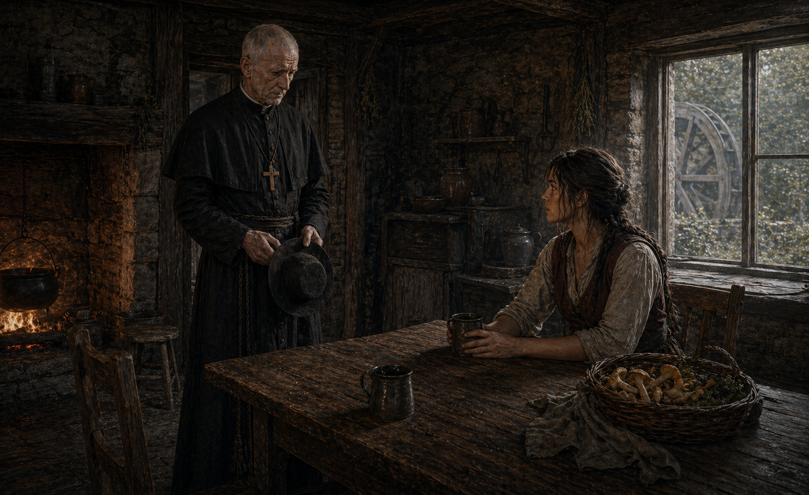

### Scene Purpose

Introduce principled opposition. Calden is not a villain; he is afraid of being careless with people he shepherds.

### Narrative Passage

Father Calden came to the mill and refused tea.

That was how Wren knew the visit would be serious. In Hollowfen, refusing tea was either illness, insult, or priesthood under strain.

He stood inside the door with his hat in both hands. The second cup cooled untouched across from Wren.

"I knew your father," he said. "I baptized you. So I will say this once and kindly: leave the deep wood alone."

Wren looked at the foraging basket on the table. Three Goldfoots sat there, ordinary as buttons if one did not know their worth.

"The old ways don't return because we've forgotten them," Calden said. "They were forgotten on purpose."

"By whom?"

His mouth tightened.

"By people who believed they were protecting their own."

That answer contained more fear than certainty.

When he left, he took the chapel garden key from its hook beside the vestry door. By sundown the gate was locked.

Almy said nothing when Wren told her. Her silence was old enough to have roots.

### Gameplay Mission

**Mission title:** Father Calden's Doubt  
**Quest ID:** `caldenWarning`  
**Location:** Tobin's mill, chapel garden gate  
**Player goal:** Hear Calden's warning and lose access to the chapel garden until Act III.

### Objectives

- Return to the mill after village recovery milestone.
- Speak with Calden.
- Visit the chapel garden gate.
- Receive locked-garden state.
- Speak optionally with Almy.

### Required Dialogue

| Speaker | Line |
|---|---|
| Calden | "I knew your father. I baptized you." |
| Calden | "So I will say this once and kindly: leave the deep wood alone." |
| Wren | "The Edge Woods fed your village this month." |
| Calden | "The edge of a thing is not the thing." |
| Wren | "What are you afraid of?" |
| Calden | "Being late to wisdom. Being early to harm." |

### Rewards and Unlocks

- Lock: chapel garden cultivation site.
- Unlock: Calden doubt flag.
- Unlock: Act III reconciliation setup.
- Act II complete.

---

# Act II Completion State

By the end of Act II, the player has:

- Learned mushroom cultivation from Sister Almy.
- Planted the first Wood Ear cultivation log.
- Commissioned and received a proper foraging knife from Joren.
- Met Master Voss and understood the tax deadline pressure.
- Helped save the Wenmar family cottage from seizure.
- Established Theo as a recurring trader and market-pricing NPC.
- Found Brightspore and helped Edda's grandfather recover.
- Met Hollin at the inn.
- Seen two boarded cottages reopen.
- Built enough village hope that Hollowfen feels visibly changed.
- Heard Father Calden's warning and lost access to the chapel garden.

## Act II Flags

| Flag | Set When |
|---|---|
| `act2_started` | Almy's cultivation lesson begins. |
| `cultivation_unlocked` | Wren plants the first inoculated log. |
| `wood_ear_log_planted` | First Wood Ear log is placed in the mill yard. |
| `joren_met` | Wren speaks to Joren at the forge. |
| `foraging_knife_unlocked` | Joren completes the horn-handled knife. |
| `voss_first_visit_seen` | Voss presents the twelve-silver demand. |
| `wenmar_tax_paid` | Wren contributes enough coin before sundown. |
| `theo_met` | Theo introduces his trade ledger. |
| `theo_trade_unlocked` | First Theo sale completes. |
| `brightspore_known` | Brightspore entry unlocks. |
| `brightspore_tonic_made` | Marra/Almy prepares the tonic. |
| `edda_grandfather_recovering` | Grandfather eats a full bowl. |
| `hollin_met` | Hollin's first inn conversation completes. |
| `cottages_reopened_1` | First cottage state changes from boarded to lived-in. |
| `cottages_reopened_2` | Second cottage state changes from boarded to lived-in. |
| `calden_warning_received` | Calden warns Wren away from the Deep Wood. |
| `chapel_garden_locked` | Chapel garden gate becomes unavailable. |
| `act2_complete` | Calden's doubt scene completes. |

## Relationship Changes

| NPC | Change | Reason |
|---|---:|---|
| Almy | +20 | Teaches cultivation and sees Wren take the work seriously. |
| Joren | +8 | Wren commissions real work and respects his craft. |
| Voss | +3 | He notices Wren as economically significant. |
| Theo | +12 | First trade establishes mutual usefulness. |
| Edda | +18 | Wren saves someone Edda loves. |
| Bram | +8 | The inn has repeat business again. |
| Marra | +10 | Wren brings ingredients worthy of Marra's skill. |
| Pell | +8 | Visible recovery gives him something worth recording. |
| Calden | -5 | He grows concerned and blocks the chapel garden. |
| Village Hope | +35 | Tax relief, medicine, trade, and reopened cottages prove recovery is real. |

## Act II Production Priorities

1. Make the village visibly respond to player progress.
2. Treat Voss as pressure, not melodrama.
3. Make cultivation tactile and slow, distinct from wild foraging.
4. Keep Theo charming without making him obviously untrustworthy.
5. Make Edda's grandfather recovery the act's emotional center.
6. Let Calden's opposition feel principled and human.

---

# Act III - Discovery

## Act Function

Act III reveals that Hollowfen's problem is historical and ecological, not only economic. The personal inheritance becomes a communal inheritance, and the village's recovery becomes tied to suppressed knowledge, the Witch's Cottage, the Wend's old course, and Lord Aldric's upstream damage.

## Act III Mission Chain

| Order | Quest ID | Mission Title | Story Card | Primary Goal |
|---|---|---|---|---|
| 16 | `hollinReveals` | Hollin's Inheritance | `hollin_inheritance` | Learn Hollin's lineage. |
| 17 | `findWitchCottage` | The Witch's Cottage | `witch_cottage` | Find the old hedge-witch's cottage. |
| 18 | `wendlightFound` | The Wend's True Course | `wend_truth` | Use Wendlight to prove the river's old course. |
| 19 | `caldenReconcile` | The Chapel Garden Opens | `chapel_garden` | Receive Calden's apology and the garden key. |
| 20 | `eddaApprentice` | Edda Asks | `edda_apprentice` | Accept Edda as apprentice. |
| 21 | `theoCapitalOffer` | Theo's Capital | `theo_capital_offer` | Hear Theo's offer to leave for the Capital. |
| 22 | `festivalHosted` | The First Festival in Three Years | `first_festival` | Prepare and host the village festival. |
| 23 | `aldricLetter` | A Sealed Letter | `sealed_letter` | Receive Lord Aldric's letter. |

---

## Scene 1 - Hollin's Inheritance

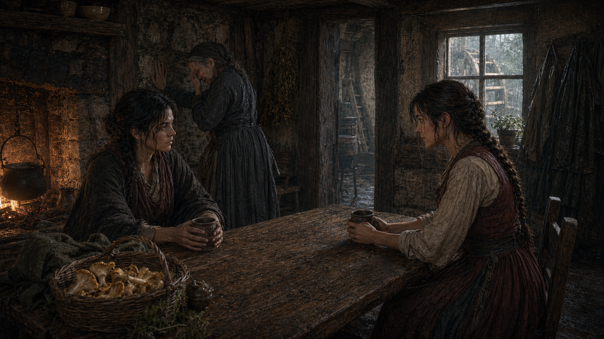

### Narrative Passage

Rain found every weakness in the mill roof.

Wren and Hollin sat at the kitchen table with mugs cooling between them while Almy stood by the hearth, one hand against the stone. Hollin had brought a page folded into oilcloth. It was not a map, not exactly. It was a child's copy of an older drawing, all wrong distances and careful labels.

"My grandmother was named Sable," Hollin said.

Almy closed her eyes.

The name changed the room.

Sable had been the last hedge-witch of Hollowfen, though no one said the word witch in daylight without lowering their voice. She had taught Almy. She had known Wren's grandmother. She had gone into the Deep Wood one spring and returned with half her hair white and a seedbook no one was allowed to read.

"She was my grandmother," Hollin said. "And she left me half a story."

Wren looked at Tobin's journal, then at Hollin's folded page.

"We seem to have inherited different halves of the same broken thing."

Almy turned toward the hearth before either young woman could see her face clearly.

"Then stop admiring the break," she said. "Find the other pieces."

### Gameplay Mission

**Quest ID:** `hollinReveals`  
**Player goal:** Learn Hollin's lineage and begin the Witch's Cottage search.

### Objectives

- Meet Hollin at the mill on a rainy morning.
- Compare Tobin's journal with Hollin's page.
- Ask Almy about Sable.
- Unlock Deep Wood route clue.

### Required Dialogue

| Speaker | Line |
|---|---|
| Hollin | "My grandmother was named Sable." |
| Almy | "Do not say that name carelessly." |
| Wren | "You knew her." |
| Almy | "I failed her. That is not the same thing." |
| Hollin | "She left me half a story." |
| Wren | "Then we find the other half." |

### Unlocks

- Unlock: Deep Wood search area.
- Hollin trust +15.
- Almy relationship +10.

---

## Scene 2 - The Witch's Cottage

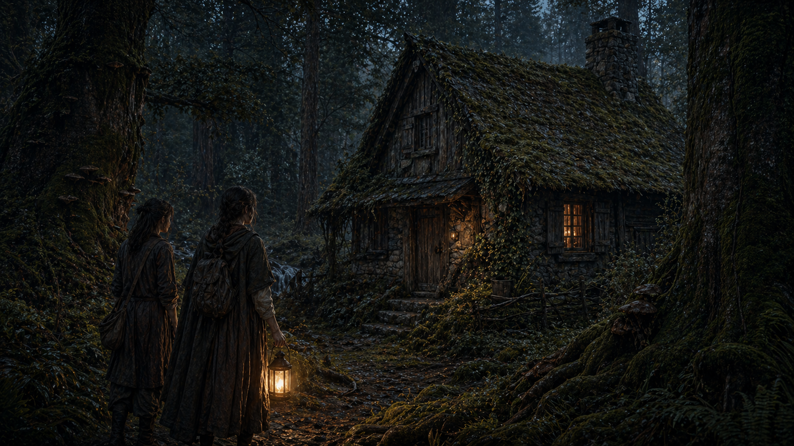

### Narrative Passage

The path did not appear until Almy stopped looking for it.

That was how she explained it, though Wren suspected the path had been there all along, waiting for someone to stop forcing memory into a straight line. Hollin walked first, touching old trunks with two fingers. Wren followed with Tobin's journal under her coat. Almy came last, breathing hard and pretending not to.

The cottage stood where the Deep Wood gathered around a spring.

It was smaller than Wren expected. One room. Stone lower walls, timber above, moss thick on the thatch, ivy grown over one shutter like a closed eye. The door opened when Hollin lifted the latch.

Inside, the air smelled of clay jars, old ash, and pages.

The seedbook lay on the table.

Almy made a sound so small Wren might have missed it if the forest had not gone quiet.

The open page showed a mushroom drawn in pale ink beside a spring basin. Witchwell. Below it, in another hand, three names: Moonring. Hollowheart. Wendlight.

Wren felt the story widen beneath her feet.

### Gameplay Mission

**Quest ID:** `findWitchCottage`  
**Player goal:** Find the Witch's Cottage and recover Sable's seedbook.

### Objectives

- Follow Hollin into the Deep Wood.
- Use environmental clues to stay on the old path.
- Find the cottage.
- Inspect the spring, table, jars, and seedbook.
- Unlock Tier 4 mushroom knowledge.

### Required Dialogue

| Speaker | Line |
|---|---|
| Hollin | "I think the path remembers feet better than names." |
| Wren | "That is either comforting or not." |
| Almy | "Both. Usually both." |
| Wren | "Is this it?" |
| Almy | "This is where I was young." |
| Hollin | "Then we should enter kindly." |

### Unlocks

- Unlock: Witch's Cottage location.
- Unlock: Tier 4 journal entries `moonring`, `hollowheart`, `wendlight`.
- Unlock: Witchwell spring as non-cultivable rare source.

---

## Scene 3 - The Wend's True Course

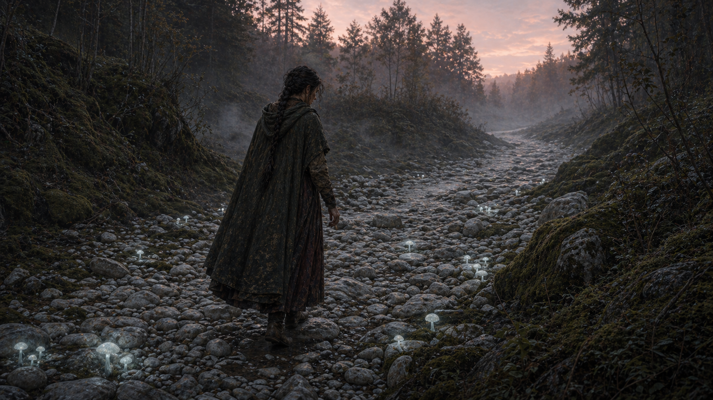

### Narrative Passage

Wendlight grew where water had been betrayed.

That was the line in Sable's book. Wren read it four times before dawn, then walked the dry riverbed with cold hands and no breakfast.

The old Wend lay pale beneath her boots, all rounded stones and grass fingers. Mist clung low between the banks. At first she saw nothing. Then the light changed.

Small mushrooms glowed faintly among the stones. Not bright. Not magical. A thin watery shine, like moonlight caught under skin.

They followed the old course.

Wren walked until the village was behind her and the pattern was undeniable. The river had not wandered from age or weather. It had been loosened, hurried, stripped of the trees that held its banks upstream.

At the bend, she found a broken timber mark stamped with Lord Aldric's device.

For three winters, Hollowfen had called the river's leaving an act of God.

Wren knelt in the stones and closed her hand around nothing at all.

"No," she said.

### Gameplay Mission

**Quest ID:** `wendlightFound`  
**Player goal:** Find Wendlight and prove the river's old course was disrupted.

### Objectives

- Read Sable's Wendlight entry.
- Walk the dry riverbed at dawn.
- Identify Wendlight clusters.
- Follow the old river course.
- Find evidence of upstream logging.

### Required Dialogue

| Speaker | Line |
|---|---|
| Wren | "Wendlight by the old stones. Wendlight where clean water ran." |
| Wren | "This is a line." |
| Wren | "Not weather. Not God. A line." |
| Hollin | "Whose?" |
| Wren | "Aldric's." |

### Unlocks

- Unlock: Wend Source investigation for Act IV.
- Unlock: Lord Aldric causal flag.
- Knowledge score +15.

---

## Scene 4 - The Chapel Garden Opens

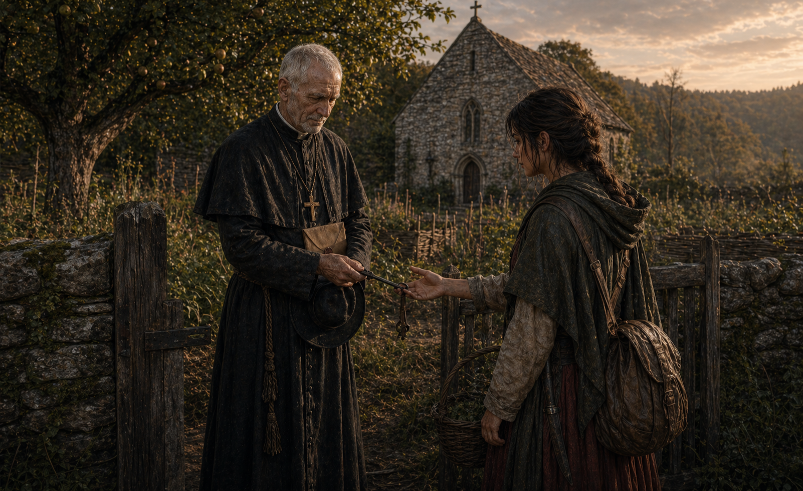

### Narrative Passage

Father Calden found the apology in church records before he found it in himself.

He came to the chapel garden gate near sunset with a brown envelope under one arm and the iron key in his hand. The beds behind him had gone half-wild. Almy's herbs leaned through the fence as if listening.

"The church helped bury this knowledge," he said.

Wren waited.

"Not because it was sorcery. Because land held by women, widows, and common healers made poor men harder to frighten and rich men harder to obey."

The key looked too heavy for the small thing it was.

"I will not bless what I do not understand," Calden said. "But I will no longer stand in its way."

Wren took the key.

"That is not the same as forgiveness," he said.

"No," Wren said. "But it is a gate opening."

For the first time since his warning, Calden looked her in the eye.

### Gameplay Mission

**Quest ID:** `caldenReconcile`  
**Player goal:** Receive the chapel garden key and unlock the garden cultivation site.

### Objectives

- Bring Wendlight evidence or Sable's record to Calden.
- Wait one day for him to search the church records.
- Meet him at the chapel garden.
- Receive key and apology.
- Unlock chapel garden beds.

### Required Dialogue

| Speaker | Line |
|---|---|
| Calden | "The church helped bury this knowledge." |
| Wren | "Because it was wicked?" |
| Calden | "Because it was useful to people who were not powerful." |
| Calden | "I will not bless what I do not understand. But I will no longer stand in its way." |
| Wren | "That is a gate opening." |

### Unlocks

- Unlock: chapel garden cultivation site.
- Calden relationship +15.
- Almy relationship +5.

---

## Scene 5 - Edda Asks

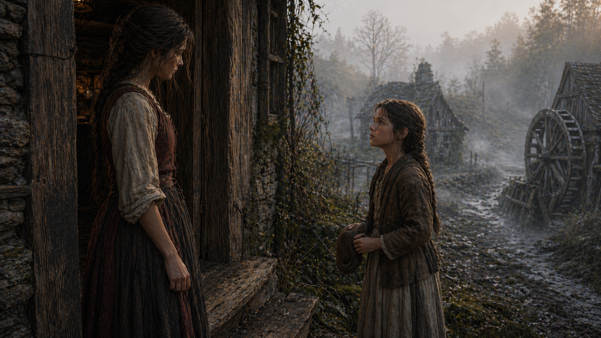

### Narrative Passage

Edda arrived at the mill before sunrise with her hair braided too tightly and her hat held in both hands.

Wren opened the door half asleep. Edda stood one step down, which made them nearly level. She had scrubbed her face. There was mud on her boots anyway.

"I would like to be apprenticed," Edda said.

Wren blinked.

Edda swallowed, angry at her own throat for needing to.

"Properly. Not carrying baskets. Not watching from paths. I want to learn names, and false names, and where to cut, and when not to. Grandfather is well enough now. I asked him. He said I should stop hovering over his soup and go become troublesome somewhere useful."

Wren leaned against the doorframe.

"Did you practice that?"

"Eleven times."

"It was good."

"Is that yes?"

Wren looked at the dry streambed, the still wheel, the morning mist gathering where water used to be.

"Yes," she said. "But you start with cleaning the knife."

Edda's face did not smile. The rest of her did.

### Gameplay Mission

**Quest ID:** `eddaApprentice`  
**Player goal:** Accept Edda as apprentice and unlock apprentice tasks.

### Objectives

- Answer the mill door at first light.
- Hear Edda's request.
- Give her first lesson.
- Assign her a safe delivery or observation task.

### Required Dialogue

| Speaker | Line |
|---|---|
| Edda | "I would like to be apprenticed." |
| Wren | "To whom?" |
| Edda | "Do not make me say the obvious part. I practiced the other part." |
| Wren | "Then say it." |
| Edda | "I want to learn names, and false names, and where to cut, and when not to." |
| Wren | "Yes. But you start with cleaning the knife." |

### Unlocks

- Unlock: apprentice system.
- Edda relationship +20.
- Unlock: Edda can run low-risk deliveries.

---

## Scene 6 - Theo's Capital

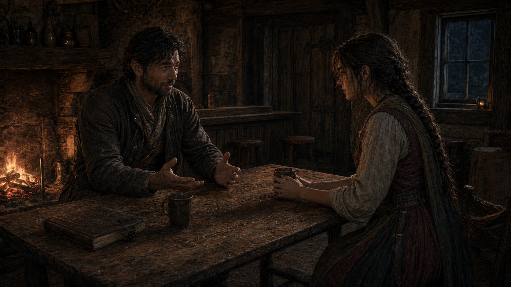

### Narrative Passage

Theo waited until the inn was empty.

That was the kindness in it, Wren thought. Or the calculation. With Theo, the two often wore the same coat.

He placed a closed ledger on the table between them and did not open it.

"I have a buyer in the Capital," he said. "Not a buyer, really. A backer. Kitchen space. Proper signage. Staff within a year if you do not insult everyone important."

"I would insult half."

"That is within tolerance."

The hearth had burned low. Marra had gone to bed. Bram pretended to be asleep in a chair by the bar and fooled no one.

Theo did not smile when he said the rest.

"It would cost Hollowfen you."

Wren looked into her cup. Dark wine, untouched.

"You think I do not know that?"

"I think you know it better than I do. I am saying it so the offer is clean."

That was the trouble. It was clean. It was generous. It was a door she had once wanted more than anything.

### Gameplay Mission

**Quest ID:** `theoCapitalOffer`  
**Player goal:** Hear Theo's offer and open the Capital ending path.

### Objectives

- Meet Theo in the empty inn at night.
- Hear the Capital partnership offer.
- Ask optional questions about cost, Hollowfen, and timing.
- Leave without choosing yet.

### Required Dialogue

| Speaker | Line |
|---|---|
| Theo | "I have a buyer in the Capital. Not a buyer, really. A backer." |
| Wren | "For mushrooms?" |
| Theo | "For you." |
| Theo | "It would cost Hollowfen you." |
| Wren | "You think I do not know that?" |
| Theo | "I think you know it better than I do. I am saying it so the offer is clean." |

### Unlocks

- Unlock: Ending C candidate path.
- Theo relationship +10.
- Wren internal conflict journal entry.

---

## Scene 7 - The First Festival in Three Years

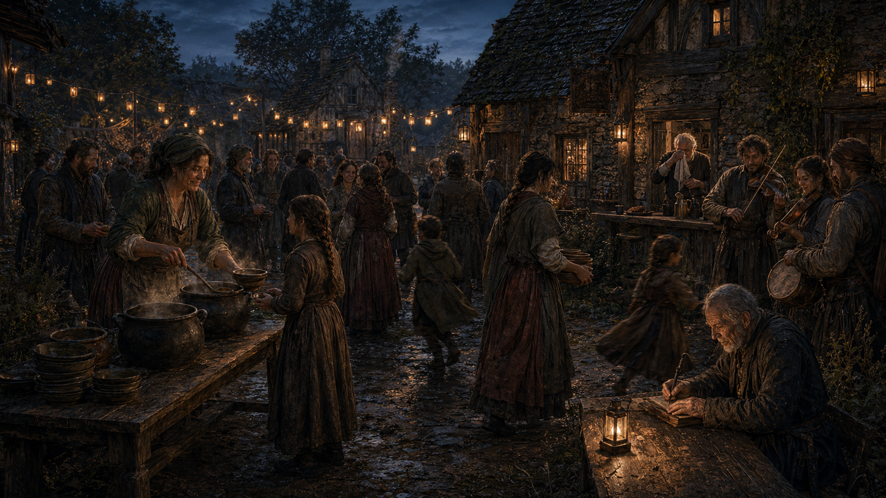

### Narrative Passage

Hollowfen remembered festivals badly at first.

Someone hung lanterns too low. Someone else argued over whether there had once been music before or after the first bowl. Bram put a barrel outside the inn, moved it three times, and then stood beside it with the face of a man guarding a miracle from weather.

Marra cooked four dishes by sundown: Goldfoot stew, Lacewig broth, Field Cap cakes, and a bitter Brightspore tonic for those who claimed they were too old for dancing. She threatened three helpers, praised none of them, and sent Wren to wash bowls whenever gratitude became too thick in the air.

The square filled before the lanterns were lit.

Pell wrote by lamplight on the inn step. When Wren passed with a stack of bowls, she saw her name in the ledger and pretended she had not.

Halfway through the evening she escaped behind the inn.

Edda found her there and said nothing.

For once, that was exactly right.

### Gameplay Mission

**Quest ID:** `festivalHosted`  
**Player goal:** Prepare four signature dishes and host the first festival in three years.

### Objectives

- Collect ingredients for four dishes.
- Coordinate with Marra, Bram, Edda, and Pell.
- Complete timed cooking/prep tasks before sundown.
- Serve villagers.
- Trigger festival scene.

### Required Dialogue

| Speaker | Line |
|---|---|
| Marra | "Four dishes by sundown. If anyone calls it rustic, I will make them eat the garnish." |
| Bram | "I remember where the lantern hooks go. Mostly." |
| Pell | "This year's page may need more ink." |
| Edda | "You are hiding." |
| Wren | "I am washing bowls privately." |
| Edda | "That is hiding with dishes." |

### Unlocks

- Village Hope +20.
- Festival world state.
- Pell records "the year the Hollow turned."
- Unlock Act III final letter trigger.

---

## Scene 8 - A Sealed Letter

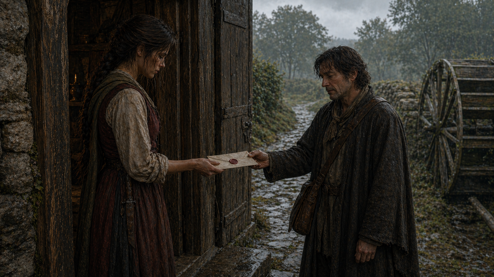

### Narrative Passage

Voss came between tax days.

That alone brought Bram out from behind the bar and Marra to the kitchen door with a knife still in her hand. But Voss did not enter the inn. He walked to the mill in a coat dusted from the road and stood one step below Wren's threshold.

He looked tired in a way his ledgers usually forbade.

"I am not here to collect," he said.

The letter in his hand was folded thick and sealed with dark red wax.

"Lord Aldric asked that I deliver this personally."

Wren took it with both hands. The seal bore a mark she had seen burned into timber at the Wend's old bend.

Voss did not let go immediately.

"Whatever it says," he said, "read it before the rumor reaches the inn."

"Do you know what it says?"

"No."

For the first time, Wren believed him.

### Gameplay Mission

**Quest ID:** `aldricLetter`  
**Player goal:** Receive Lord Aldric's sealed letter and end Act III.

### Objectives

- Return to the mill after the festival.
- Meet Voss at the door.
- Receive the sealed letter.
- Choose to open it now or wait until evening.

### Required Dialogue

| Speaker | Line |
|---|---|
| Voss | "I am not here to collect." |
| Wren | "That is new." |
| Voss | "Lord Aldric asked that I deliver this personally." |
| Voss | "Whatever it says, read it before the rumor reaches the inn." |
| Wren | "Do you know what it says?" |
| Voss | "No." |
| Wren | "Do you want to?" |
| Voss | "No." |

### Unlocks

- Unlock: Aldric letter.
- Unlock: Act IV.
- Voss complexity flag.

---

# Act III Completion State

By the end of Act III, the player has:

- Learned Hollin is Sable's granddaughter.
- Connected Wren, Hollin, Almy, Sable, and Wren's grandmother into one broken lineage.
- Found the Witch's Cottage in the Deep Wood.
- Recovered Sable's seedbook.
- Unlocked Tier 4 mushroom knowledge.
- Found Wendlight in the dry riverbed.
- Proven that the Wend's course shift was caused by upstream damage.
- Learned Lord Aldric's estate is connected to the river's failure.
- Reconciled partially with Father Calden.
- Unlocked the chapel garden as a cultivation site.
- Accepted Edda as an apprentice.
- Heard Theo's offer to leave for the Capital.
- Hosted the first village festival in three years.
- Received Lord Aldric's sealed letter from Voss.

## Act III Flags

| Flag | Set When |
|---|---|
| `act3_started` | Hollin reveals Sable's name. |
| `hollin_lineage_revealed` | Hollin identifies herself as Sable's granddaughter. |
| `sable_named` | Sable becomes a known historical figure. |
| `witch_cottage_found` | Player reaches the Witch's Cottage. |
| `sable_seedbook_recovered` | Seedbook is inspected or collected. |
| `tier4_mushrooms_unlocked` | Moonring, Hollowheart, and Wendlight entries unlock. |
| `wendlight_known` | Wendlight entry is identified. |
| `wend_old_course_mapped` | Player follows enough Wendlight clusters. |
| `aldric_logging_evidence_found` | Timber mark or equivalent evidence is found. |
| `calden_records_read` | Calden researches church records. |
| `chapel_garden_key_received` | Calden gives Wren the key. |
| `chapel_garden_unlocked` | Chapel garden becomes usable. |
| `edda_apprentice_accepted` | Wren says yes to Edda. |
| `apprentice_system_unlocked` | Edda tasks become available. |
| `theo_capital_offer_received` | Theo makes the Capital offer. |
| `festival_prepared` | Four festival dishes are completed. |
| `festival_hosted` | Festival scene completes. |
| `aldric_letter_received` | Voss delivers the sealed letter. |
| `act3_complete` | Player receives or opens the sealed letter. |

## Relationship Changes

| NPC | Change | Reason |
|---|---:|---|
| Hollin | +25 | Trust deepens through shared inheritance and the Witch's Cottage. |
| Almy | +18 | Her unfinished past is acknowledged and carried forward. |
| Calden | +20 | He admits institutional harm and opens the garden. |
| Edda | +25 | Wren accepts her as apprentice. |
| Theo | +10 | He makes an honest, costly offer. |
| Bram | +10 | Festival restores the inn's public role. |
| Marra | +15 | Festival lets her cook with pride again. |
| Pell | +12 | He records the turning point in ink. |
| Voss | +5 | He becomes more than a tax function by delivering the letter personally. |
| Village Hope | +45 | Cottage recovery, festival, apprenticeship, and garden unlock make renewal public. |
| Knowledge | +45 | Witch's Cottage, Wendlight, and suppressed history reshape the story. |

## Act III Production Priorities

1. Make the Deep Wood feel older and quieter than the Edge Woods.
2. Treat the Witch's Cottage as discovery, not spectacle.
3. Make Wendlight subtle and biological, never spell-like.
4. Give Calden's apology weight without fully resolving every harm.
5. Make Edda's apprenticeship feel like the village's future becoming visible.
6. Let the festival feel communal, busy, and earned.

---

# Act IV - The Choice

## Act Function

Act IV asks what kind of place Hollowfen becomes. The village can remain independent, accept lordly patronage, lose Wren to the Capital, or become a quieter center of restored old knowledge. The antagonist is not a monster. Aldric is orderly, persuasive, and wrong in ways that can still feed people.

## Act IV Mission Chain

| Order | Quest ID | Mission Title | Story Card | Primary Goal |
|---|---|---|---|---|
| 24 | `aldricOfferRead` | The Lord's Offer | `aldric_offer` | Read Aldric's proposal. |
| 25 | `wendSource` | The Source of the Wend | `wend_source` | Investigate the upstream clear-cut. |
| 26 | `meetAldric` | The Meeting | `meeting_aldric` | Negotiate with Lord Aldric. |
| 27 | varies | Final Ending | ending card | Resolve Hollowfen's future. |

---

## Scene 1 - The Lord's Offer

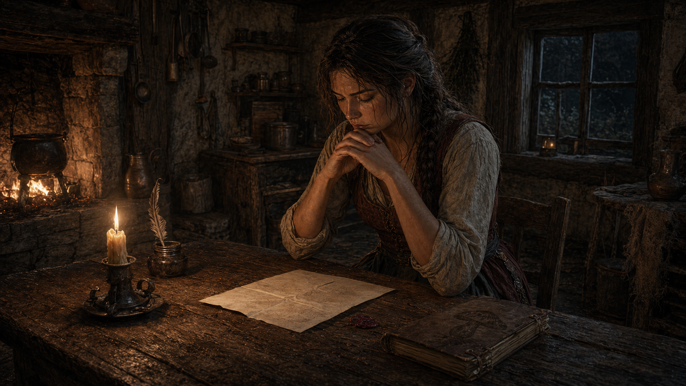

### Narrative Passage

Lord Aldric wrote beautifully.

That was the first danger.

His letter did not threaten. It regretted. It admired. It confessed, with graceful restraint, that Hollowfen had been presumed finished in the ledgers of his house. It praised Miss Tobin's unusual enterprise. It proposed patronage, protection, expanded trade roads, tax relief, and a formal monopoly under Aldric's banner.

The terms were generous.

Wren read them once as herself, once as Tobin's daughter, and once as if her grandmother sat across from her with flour on her sleeve and opinions in her eyebrows.

On the third reading, she found the hook.

All cultivation records, wild-harvest routes, medicinal preparations, and trade rights would be held in trust by Aldric's estate for the protection of Hollowfen and surrounding villages.

Held in trust.

Owned, in prettier clothes.

The candle burned low. Tobin's journal lay closed at the corner of the table. Wren touched the broken red seal and wondered how many villages had been saved into obedience before anyone thought to call it loss.

### Gameplay Mission

**Quest ID:** `aldricOfferRead`  
**Player goal:** Read Aldric's offer and identify its cost.

### Objectives

- Open the sealed letter at the mill table.
- Read the offer.
- Inspect key clauses.
- Write Wren's journal response.
- Decide who to consult before answering.

### Required Dialogue / Letter Text

| Speaker | Line |
|---|---|
| Aldric's letter | "I had presumed, speaking honestly, that Hollowfen was finished." |
| Aldric's letter | "You have made that presumption incorrect, Miss Tobin." |
| Aldric's letter | "I propose patronage, tax relief, and lawful protection under my banner." |
| Aldric's letter | "All cultivation records, wild-harvest routes, medicinal preparations, and trade rights shall be held in trust by my estate." |
| Wren | "Held in trust. Owned, in prettier clothes." |

### Unlocks

- Unlock: Consult NPCs about Aldric.
- Unlock: ending preparation objectives.

---

## Scene 2 - The Source of the Wend

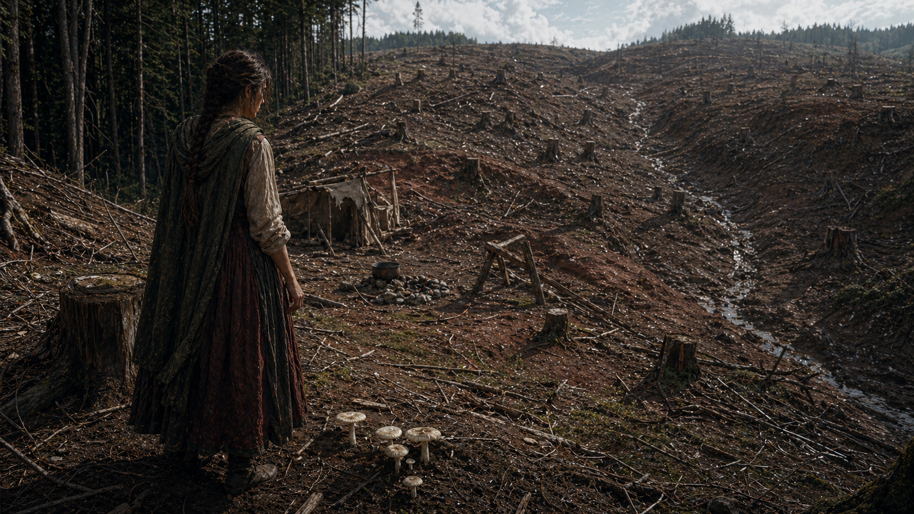

### Narrative Passage

The source of the Wend was not a spring.

Not anymore.

Wren reached the hillside near midday and found stumps in rows. Drag trails cut the earth like old wounds. A collapsed canvas shelter lay beside a cold fire-ring. Someone had left a cookpot to rust and a saw-horse tipped on its side, as if the work had stopped only when the profit did.

Below the cleared slope, a thin trickle of water ran too fast over bare ground.

This was what had happened to the river. Not curse, not age, not divine correction. Trees gone. Soil loosened. Rain unheld. Water choosing the easiest wound.

At the edge of the cut, where living forest still pressed its roots into the slope, Wren found Aldermark mushrooms growing pale and stubborn in the shade.

Theo would know their price. Aldric would know it better.

Wren did not cut them at first.

She stood with her hands loose at her sides and let the anger become useful before she trusted herself with a knife.

### Gameplay Mission

**Quest ID:** `wendSource`  
**Player goal:** Investigate the upstream clear-cut and gather Aldermark leverage.

### Objectives

- Travel to the upstream clear-cut.
- Inspect stumps, camp, drag trails, and watercourse.
- Find Aldric timber marks.
- Identify Aldermark mushrooms.
- Decide whether to harvest samples.

### Required Dialogue

| Speaker | Line |
|---|---|
| Wren | "This is where the river was broken." |
| Hollin | "Not broken. Loosed." |
| Wren | "That is worse." |
| Hollin | "Yes." |
| Wren | "Aldermark at the edge. Of course something useful grows where harm stops." |

### Unlocks

- Unlock: Aldermark specimen.
- Unlock: negotiation leverage.
- Knowledge score +15.
- Ending A/D support if evidence is shown to village.

---

## Scene 3 - The Meeting

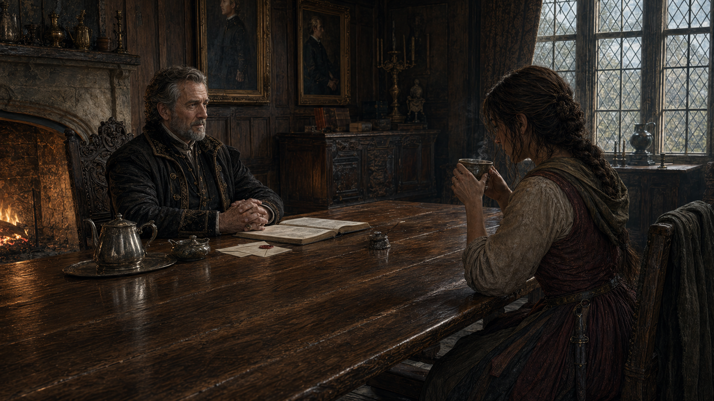

### Narrative Passage

Lord Aldric's manor was smaller than rumor and cleaner than kindness.

He received Wren in an oak-paneled study with tea already poured. That was his first move: not command, not threat, but civility so complete it made refusal feel rude.

"I should very much like to make your acquaintance, Miss Tobin," he said.

"You sent a letter."

"A letter is not an acquaintance. Merely an opening bid."

He was not cruel. Wren had prepared for cruel and found, instead, a careful man with good manners and ledgers where other people kept guilt. He listened when she spoke of the Wend. He did not deny the woodcutters. He regretted the consequence as one might regret rain through a roof he had not personally patched.

"I can make Hollowfen prosperous," he said.

"Yes."

The answer surprised him.

Wren set the Aldermark sample on the polished table.

"The question is what you think prosperous is allowed to cost."

The room became very quiet around them.

### Gameplay Mission

**Quest ID:** `meetAldric`  
**Player goal:** Meet Lord Aldric and choose Hollowfen's future.

### Objectives

- Travel to Aldric's manor.
- Present evidence or withhold it.
- Discuss patronage, independence, Capital offer, and old knowledge.
- Make final choice.
- Trigger ending based on choice and thresholds.

### Required Dialogue

| Speaker | Line |
|---|---|
| Aldric | "I should very much like to make your acquaintance, Miss Tobin." |
| Wren | "You sent a letter." |
| Aldric | "A letter is not an acquaintance. Merely an opening bid." |
| Aldric | "I can make Hollowfen prosperous." |
| Wren | "Yes." |
| Aldric | "You concede that?" |
| Wren | "I concede arithmetic." |
| Wren | "The question is what you think prosperous is allowed to cost." |

### Unlocks

- Trigger final ending choice.
- Lock Act IV branch.

---

## Ending A - The Free Hollow

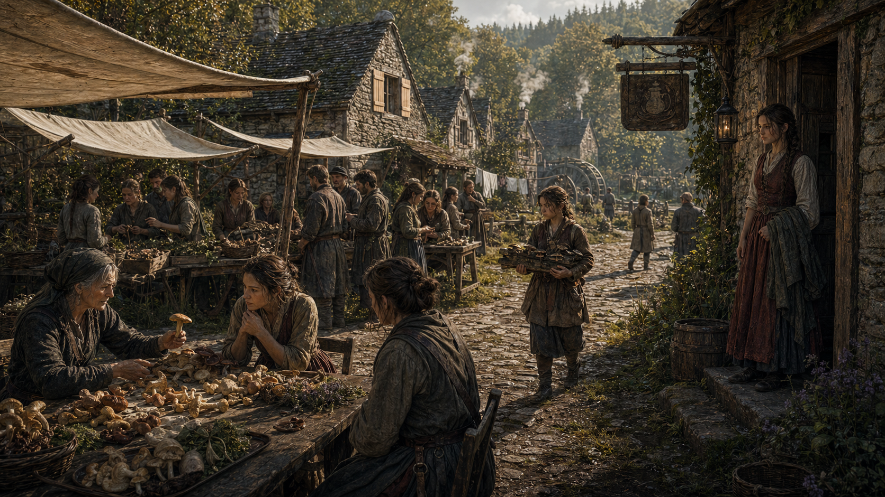

### Narrative Passage

Wren said no, and the saying took a long time.

She refused the monopoly, accepted a smaller tax relief, traded Aldermark knowledge for a written limit on upstream cutting, and returned to Hollowfen with no banner behind her. That was the part some villagers struggled with. Prosperity under a lord had shape. Independence looked, at first, like more work.

A year later, the square was full.

Not rich. Full.

Foragers came from neighboring villages to learn from Almy. Theo still bought what Wren chose to sell and complained cheerfully about her prices. Edda taught children to turn mushrooms over before trusting them. Marra's Goldfoot stew brought travelers in weather that would once have emptied the road.

The mill wheel did not turn. The Wend had not come back.

But Hollowfen no longer waited for the river to decide whether it deserved to live.

Wren wrote the next page of Tobin's journal in her own hand.

### Ending Conditions

- Requires high Village Hope and community help.
- Requires Voss tax harm prevented at least once.
- Requires evidence from Wend Source.
- Refuse Aldric's monopoly.

### Final Dialogue

| Speaker | Line |
|---|---|
| Wren | "No." |
| Aldric | "That is rarely the first word in a negotiation." |
| Wren | "It is the last word in this one." |
| Aldric | "You may regret refusing protection." |
| Wren | "I expect to. That does not make it wrong." |

---

## Ending B - The Lordly Patronage

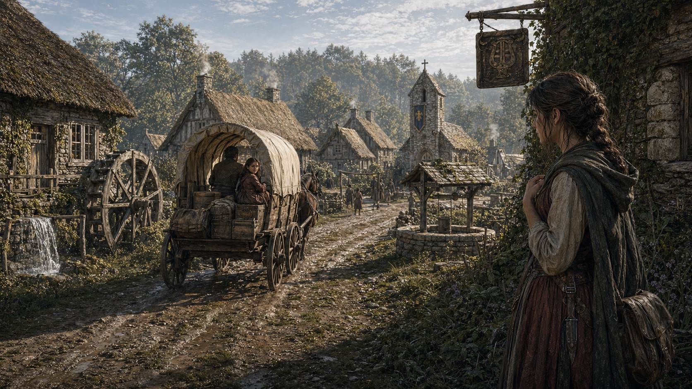

### Narrative Passage

Wren signed.

The village ate.

Those two facts stood beside each other and refused to become simple. Roofs were repaired before winter. The well was rebuilt in clean stone. A paid sluice brought enough water to turn the mill wheel for show and some grinding. Aldric's banner hung near the chapel gate, small but visible from the square.

Marra had better copper pots. Bram hired help. Pell's ledger grew fat with deliveries, stipends, inspections, and fees waived by men who had discovered mercy after paperwork instructed them.

Theo left for the Capital alone.

Edda asked to go with him.

Wren said yes because saying no would have made the bargain worse than it already was.

At the lane's edge, Edda looked back once. Wren lifted a hand and kept it lifted until the wagon disappeared.

The village prospered. Wren lived with that.

So did the village.

### Ending Conditions

- Accept Aldric's offer.
- Any community/knowledge score permitted.
- Theo does not become Wren's final path.

### Final Dialogue

| Speaker | Line |
|---|---|
| Aldric | "You are making the practical choice." |
| Wren | "Do not make it smaller by praising it." |
| Aldric | "Very well." |
| Wren | "The village eats. That is the sentence I will use when I cannot sleep." |

---

## Ending C - The Capital

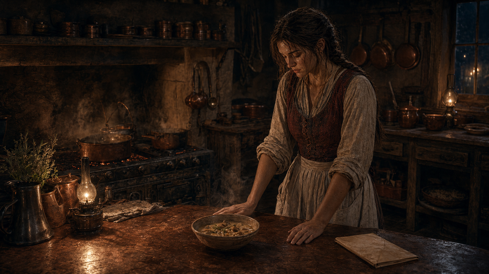

### Narrative Passage

Wren left in spring.

That was kinder than winter and crueler than autumn. Spring made departures look like beginnings whether they were or not.

Theo's Capital kitchen became famous within a year. Infamous within three. Wren cooked Goldfoot stew for people who had never seen mud except as inconvenience. She learned suppliers, knives, ledgers, staff, critics, hunger of a different sort. She sent money home until Hollowfen stopped needing it and letters until Edda started answering with more confidence than spelling.

Hollin stayed.

Almy gave her the seedbook before the first frost and pretended it was only because her eyes were tired.

Years later, after service, Wren stood alone at a copper-topped table with one bowl of golden stew between her hands. An unopened letter from Hollowfen sat beside it.

For a moment, she almost did what her father had done.

Then she opened it.

### Ending Conditions

- Accept Theo's Capital offer.
- Theo relationship high enough.
- Final choice: leave Hollowfen.

### Final Dialogue

| Speaker | Line |
|---|---|
| Theo | "Last chance to decide I am a terrible idea." |
| Wren | "You are a terrible idea." |
| Theo | "And?" |
| Wren | "And the road is open." |
| Edda | "Will you write?" |
| Wren | "Yes. And if I stop, come be angry at me." |

---

## Ending D - The Witch's Path

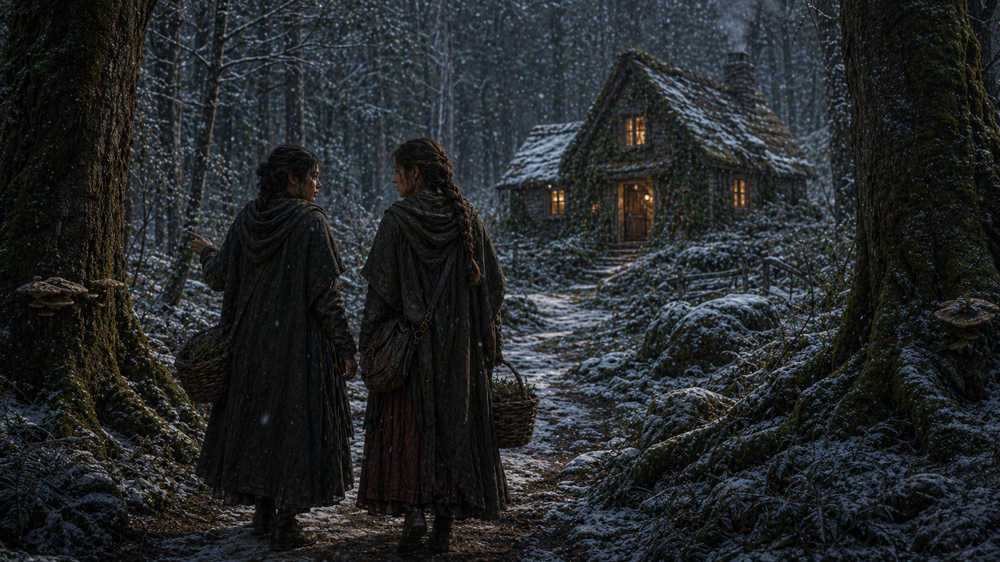

### Narrative Passage

Wren refused Aldric and did not follow Theo.

That left the path no one had named clearly enough to count as a plan.

The Witch's Cottage was repaired by first snow. Joren patched the hinges. Edda hauled kindling and claimed not to be cold. Hollin trimmed back the ivy from the shutter and stood a long time before opening it.

They did not call themselves witches.

Almy laughed when Wren said so and then coughed for long enough that no one laughed with her.

"Names arrive after work," Almy said.

So they worked.

They walked the Deep Wood, named what was there, wrote what had not yet been written, and taught carefully. Hollowfen prospered more quietly than it might have under Aldric, less brightly than it might have under trade, but people came from Veyrwick with questions and left more thoughtful than they came.

At first snow, Wren and Hollin walked the path to the cottage together, neither leading.

### Ending Conditions

- Requires high knowledge score.
- Requires Hollin trust high.
- Requires Witch's Cottage restored.
- Refuse Aldric and decline Theo.

### Final Dialogue

| Speaker | Line |
|---|---|
| Hollin | "What do we call this?" |
| Wren | "Work." |
| Hollin | "People prefer grander names." |
| Wren | "Then people can be disappointed." |
| Almy | "Names arrive after work." |

---

# Act IV Completion State

By the end of Act IV, the player has:

- Read Lord Aldric's formal offer.
- Understood the offer's material benefits and political cost.
- Investigated the upstream clear-cut.
- Confirmed Aldric's logging damaged the Wend.
- Found Aldermark mushrooms as negotiation leverage.
- Met Lord Aldric at his manor.
- Chosen Hollowfen's future.
- Seen one of four endings resolve Wren's relationship to the village, trade, old knowledge, and power.

## Act IV Flags

| Flag | Set When |
|---|---|
| `act4_started` | Aldric's sealed letter is opened. |
| `aldric_offer_read` | Player reads the proposal. |
| `aldric_monopoly_clause_seen` | Player inspects or reaches the ownership clause. |
| `npc_consultations_unlocked` | Wren may ask villagers about the offer. |
| `wend_source_unlocked` | Upstream clear-cut route becomes available. |
| `wend_source_visited` | Player reaches the clear-cut. |
| `clearcut_evidence_found` | Stumps, camp, or timber marks are inspected. |
| `aldermark_known` | Aldermark entry unlocks. |
| `aldermark_sample_collected` | Player harvests or boxes a sample. |
| `aldric_meeting_started` | Player enters Aldric's manor study. |
| `final_choice_available` | Negotiation reaches decision point. |
| `ending_free_hollow` | Ending A is chosen/unlocked. |
| `ending_lordly_patronage` | Ending B is chosen/unlocked. |
| `ending_capital` | Ending C is chosen/unlocked. |
| `ending_witch_path` | Ending D is chosen/unlocked. |
| `game_complete` | Any ending resolves. |

## Ending Thresholds

| Ending | Required Emphasis | Mechanical Gate |
|---|---|---|
| The Free Hollow | Community independence | High Village Hope, enough villagers helped, Aldric refused. |
| The Lordly Patronage | Practical prosperity | Accept Aldric's offer. No high-score requirement. |
| The Capital | Personal ambition and leaving | Theo relationship high, Capital offer accepted. |
| The Witch's Path | Knowledge and lineage | High Knowledge, Hollin trust high, Witch's Cottage restored, Aldric and Theo declined. |

## Relationship Changes

| NPC | Change | Reason |
|---|---:|---|
| Aldric | varies | Respect, frustration, or patronage depends on final choice. |
| Theo | varies | He may become partner, disappointed friend, or departing trader. |
| Hollin | varies | She may stay, continue the old work, or inherit the mantle without Wren. |
| Edda | varies | She may apprentice, stay, or leave depending on ending. |
| Voss | +5 | His role changes as Hollowfen becomes harder to treat as a failing account. |
| Village Hope | final | Locked into ending montage. |
| Knowledge | final | Determines whether old lore becomes commerce, institution, or living practice. |

## Act IV Production Priorities

1. Make Aldric persuasive enough that accepting him feels understandable.
2. Make the clear-cut visually undeniable.
3. Use Aldermark as leverage, not a magic solution.
4. Make each ending bittersweet in a different direction.
5. Do not frame one ending as cartoonishly good and the others as failures.
6. Ensure the final choice reflects accumulated play, not only a dialogue button.

---

# Reference Pages

## Character List

| Character | Model Need | First Appearance | Role | Visual Notes | Gameplay Need |
|---|---|---|---|---|---|
| Wren Tobin | Unique playable model | Act I Scene 1 | Protagonist, forager, miller's daughter | Late 20s, practical layered clothes, dark braid/knot, belt pouch, knife, basket, journal | Player character, animations, outfit/accessory variants |
| Old Bram | Unique NPC | Act I Scene 1 | Innkeeper, first buyer | Sixties, broad, white beard, apron, wool waistcoat | Dialogue, shop/sell interface, inn hub |
| Marra | Unique NPC | Act I Scene 6 | Cook, recipe mentor | Mid-fifties, strong arms, kerchief, apron, sleeves rolled | Cooking quests, recipe unlocks |
| Sister Almy | Unique NPC | Act I Scene 7 | Vine-tender, cultivation mentor | Late 50s/60s, dark dress, grey kerchief, satchel, weathered hands | Cultivation tutorial, lore gates |
| Edda | Unique NPC with age progression option | Act I Scene 5 | Apprentice, village future | Fourteen, brown homespun, basket, headscarf/braid | Apprentice tasks, deliveries, emotional quests |
| Joren | Unique NPC | Act II Scene 2 | Smith, tool upgrades | Forties, broad, leather apron, soot-black arms | Tool upgrades, restoration materials |
| Master Voss | Unique NPC | Act II Scene 3 | Tax collector, external pressure | Late 40s, gaunt, drab coat, ledger satchel | Tax deadlines, Aldric messenger |
| Theo | Unique NPC | Act II Scene 4 | Trader, market access, Capital temptation | Late 30s, trim beard, better travel coat, ledger | Trade interface, wagon schedule, ending path |
| Hollin | Unique NPC | Act II Scene 6 | Deep-wood companion, Sable's granddaughter | Late 20s, pale, dark-haired, earth-toned travel clothes, satchel | Trust arc, Witch's Cottage route, ending path |
| Father Calden | Unique NPC | Act II Scene 8 | Priest, skeptic, late ally | Sixties, white-haired, dark cassock, wooden cross | Chapel garden gate, moral pressure |
| Elder Pell | Semi-unique NPC | Act II Scene 7 | Village elder, record keeper | Seventies, stooped, ledger, pencil | Restoration board, village state narration |
| Lord Aldric | Unique NPC | Act IV Scene 3 | Regional lord, final negotiator | Fifties, dark wool, velvet collar, signet ring | Final choice, ending branch |
| Edda's Grandfather | Bedridden/elder NPC | Act II Scene 5 | Named life saved | Thin, white-haired, quilted bed | Brightspore quest |
| Wenmar family | 3 villagers | Act II Scene 3 | Tax stakes | Worn rural family | Cottage seizure/prevention state |
| Generic villagers | Modular NPC set | All acts | Crowd, labor, festival, recovery | Rural workers, children, elders, travelers | Ambient dialogue, festival population |

## Objective List

| Quest ID | Mission Title | Required Locations | Required Objects/NPCs | Completion State |
|---|---|---|---|---|
| `arrive` | Homecoming | South road, village square | Bram, well, boarded cottages | Wren reaches Bram |
| `speakBram` | The Crooked Pintle | Inn | Bram, mill key | Key received |
| `searchMill` | Your Father's Mill | Mill exterior/interior | Door, coat, kettle, ledgers, wheel | Mill explored |
| `findJournal` | The Hidden Journal | Mill kitchen | Drawer, oilcloth, journal | Journal unlocked |
| `firstForage` | The First Forage | Edge Woods | Field Cap, Wood Ear, Pinecrest, Goldfoot sample, Edda | First basket gathered |
| `firstSale` | Marra's Kitchen | Inn kitchen | Bram, Marra, stew pot, coins | Selling/cooking unlocked |
| `meetAlmy` | A Knock at the Door | Mill doorway | Almy, dried stems, seedbook/satchel | Act II unlocked |
| `almyTeach` | The Vine-Tender's Lessons | Almy garden, mill yard | Logs, spawn, wax | Cultivation unlocked |
| `forgeKnife` | Joren's Forge | Smithy | Joren, anvil, foraging knife | Knife equipped |
| `firstTax` | Twelve Silver by Yule | Inn | Voss, Wenmar family, tax ledger | Cottage saved or lost |
| `theoTrade` | The Trader's Ledger | Market/village edge | Theo, wagon, trade ledger | Theo market unlocked |
| `edsGrandfather` | Brightspore at the Bedside | Old birch, inn kitchen, Edda cottage | Brightspore, tonic bottle, bed | Grandfather recovers |
| `meetHollin` | A Stranger at the Inn | Inn | Hollin, mug, satchel | Hollin trust arc unlocked |
| `cottagesReopen` | Two Boards Come Down | Cottage lane | Shutters, hinges, Pell ledger | Cottages visually reopen |
| `caldenWarning` | Father Calden's Doubt | Mill, chapel gate | Calden, locked garden gate | Garden locked |
| `hollinReveals` | Hollin's Inheritance | Mill kitchen | Hollin's page, Tobin journal, Almy | Deep Wood route unlocked |
| `findWitchCottage` | The Witch's Cottage | Deep Wood | Cottage, spring, seedbook, jars | Tier 4 unlocked |
| `wendlightFound` | The Wend's True Course | Dry riverbed | Wendlight, timber mark | Aldric cause revealed |
| `caldenReconcile` | The Chapel Garden Opens | Chapel garden | Calden, key, envelope | Garden unlocked |
| `eddaApprentice` | Edda Asks | Mill doorway | Edda, apprentice kit | Apprentice system unlocked |
| `theoCapitalOffer` | Theo's Capital | Empty inn | Theo, wine cups, closed ledger | Capital path unlocked |
| `festivalHosted` | The First Festival in Three Years | Village square | Lanterns, four dishes, villagers | Festival completed |
| `aldricLetter` | A Sealed Letter | Mill doorway | Voss, sealed letter | Act IV unlocked |
| `aldricOfferRead` | The Lord's Offer | Mill kitchen | Letter, red wax seal, candle | Consult/final prep unlocked |
| `wendSource` | The Source of the Wend | Upstream clear-cut | Stumps, camp, Aldermark, timber marks | Evidence gathered |
| `meetAldric` | The Meeting | Aldric manor | Aldric, tea, table, Aldermark | Ending chosen |

## Key Object and Item List

| Asset/Object | Category | First Needed | Notes |
|---|---|---|---|
| Mill key | Story item | Act I Scene 2 | Iron key wrapped in rag |
| Tobin's journal | Hero prop/UI | Act I Scene 4 | Brown leather, sketches, blank pages |
| Oilcloth bundle | Prop | Act I Scene 4 | Hides journal |
| Wicker basket | Wren prop | Act I Scene 5 | Should appear on model or as held prop |
| Foraging knife | Tool prop | Act II Scene 2 | Horn handle, sheath, upgradeable |
| Belt pouch | Wren prop | Always | Coins, twine, scraps |
| Field Cap | Mushroom asset | Act I | Small tan fairy-ring mushroom |
| Wood Ear | Mushroom asset | Act I | Brown rubbery fungus on logs |
| Pinecrest | Mushroom asset | Act I | Brown bolete under pines |
| Goldfoot | Mushroom asset | Act I/II | Brown cap, yellow hollow stem |
| Lacewig | Mushroom asset | Act II | Pale oyster shelves |
| Coppercup | Mushroom asset | Act II | Orange cup fungus |
| Bonepale | Mushroom asset | Act II | Birch polypore bracket |
| Brightspore | Mushroom asset | Act II | Glossy medicinal bracket, faint glow |
| Riverwhisper | Mushroom asset | Act II/III optional | Clean-water clue mushroom |
| Moonring | Mushroom asset | Act III | Full-moon ring mushroom |
| Hollowheart | Mushroom asset | Act III | Old-stump rare fungus |
| Wendlight | Mushroom asset | Act III | Faintly glowing old-river-course marker |
| Aldermark | Mushroom asset | Act IV | Leverage mushroom at clear-cut edge |
| Witchwell | Mushroom asset | Act IV/ending | Spring-only mushroom |
| Souldrop | Mushroom asset | Late/endgame | One-per-save emotional rare |
| Cultivation log | Gameplay prop | Act II | Damp inoculated logs |
| Wax plug/tool kit | Gameplay prop | Act II | Cultivation animation props |
| Voss tax ledger | NPC prop | Act II | Ledger and coins |
| Theo trade ledger | NPC prop | Act II | Wagon-side market UI prop |
| Theo wagon | Vehicle prop | Act II | Recurring trader arrival |
| Tonic bottle | Quest prop | Act II | Brightspore tonic |
| Chapel garden key | Story item | Act III | Iron key on leather thong |
| Sable's seedbook | Hero prop | Act III | Found in Witch's Cottage |
| Sealed Aldric letter | Story item | Act III/IV | Dark red wax seal |
| Aldric signet/seal | Prop | Act IV | Manor/letter identity |
| Aldermark sample box | Quest prop | Act IV | Evidence/leverage at meeting |
| Festival lanterns | Event prop | Act III | Square festival dressing |
| Four festival dishes | Food props | Act III | Stew, broth, cakes, tonic |

## Location and Environment List

| Location | Required For | Key Set Dressing | Gameplay Function |
|---|---|---|---|
| South road approach | Opening | Empty road, boarded cottages, dusk light | Arrival tutorial |
| Village square | All acts | Well, market stalls, lantern hooks | Hub, festival, restoration |
| The Crooked Pintle | Act I onward | Bar, hearth, kitchen door, copper pots | Selling, cooking, major dialogue |
| Tobin's mill | Act I onward | Still wheel, kitchen table, drawer, loft | Home base, journal, Act hooks |
| Mill yard | Act II onward | Cultivation logs, sacks, dry streambed | Growing system |
| Edge Woods | Act I onward | Birch, pine, logs, safe mushrooms | First foraging |
| Chapel garden | Act II/III | Locked gate, raised beds, apple tree | Cultivation site, Calden arc |
| Smithy | Act II onward | Forge, anvil, tools, smoke | Tool upgrades |
| Cottage lane | Act II onward | Boarded/reopened cottages | Recovery state |
| Edda's cottage | Act II | Bed, candle, tonic stool | Cure quest |
| Deep Wood | Act III | Older trees, moss, narrow path | Mystery route |
| Witch's Cottage | Act III/Ending D | Spring, jars, table, seedbook | Tier 4 unlock, ending path |
| Dry Wend riverbed | Act III | Pale stones, mist, Wendlight | Truth reveal |
| Upstream clear-cut | Act IV | Stumps, drag trails, camp | Aldric evidence |
| Aldric's manor | Act IV | Oak study, long table, portraits | Final negotiation |
| Capital kitchen | Ending C | Copper table, large range, oil lamps | Epilogue only |

## Character Model Priority

| Priority | Character(s) | Why |
|---|---|---|
| 1 | Wren | Player model, portrait, all scenes |
| 2 | Bram, Marra, Almy, Edda | Act I/II emotional core and first systems |
| 3 | Joren, Theo, Voss, Calden | Major Act II systems and conflict |
| 4 | Hollin, Pell | Act III mystery and restoration narration |
| 5 | Aldric | Endgame only but must feel polished |
| 6 | Villager modular set | Needed for village life, festival, recovery states |
| 7 | Wenmar family, Edda's grandfather | Quest-specific emotional NPCs |

## Asset Production Notes

- Wren should eventually have visible basket, knife/sheath, pouch, and journal props.
- Bram and Marra can share inn animation sets: idle, talk, serve, inspect basket.
- Almy needs garden/cultivation gestures: kneel, point, inspect log, hand key/seedbook.
- Edda needs child/teen scale, basket carry, doorway stance, apprentice idle.
- Theo needs wagon-side idle, ledger writing, coin exchange.
- Voss needs ledger count, letter handoff, seated tax-table pose.
- Calden needs formal standing, key handoff, chapel-gate pose.
- Hollin needs quiet travel idle, pathfinding companion, seedbook inspection.
- Aldric needs seated negotiation, tea table, signet/letter prop.
- Village should support world-state swaps: boarded cottage, reopened cottage, festival square, chapel garden locked/unlocked, Witch's Cottage ruined/repaired.

# Mushroom Compendium

## Compendium Function

Hollowfen's story is a foraging arc. Every act gates on a small set of new species that Wren must learn, identify safely, and put to use. The journal fills out one mushroom at a time, and the village's recovery is measured by how many entries are inked in.

**Sixteen species — four per act.** Five safe basics in Act I to teach the player the verbs (look, turn over, dig down, smell, cut). Five Act II species expand the systems — trade, cultivation, medicine, beauty. Four Act III species push into danger and old knowledge. Two Act IV species close the journal with the hardest pairings — Wren is no longer the student, she is the one who keeps the village safe.

Every mushroom is mapped to at least one canonical mission. If a player completes the main story, all sixteen entries are unlocked. The Witch's Path ending (D) and Witchwell Spring access additionally require Wren to have *understood* the dangerous species, not just collected them.

## Compendium Index

| # | Common Name | Latin Name | Edibility | Act | Primary Mission | Teacher / Buyer | Habitat |
|---|---|---|---|---|---|---|---|
| 1 | Field Cap | *Marasmius oreades* | Edible | I | `firstForage` | Bram (teacher), Marra (buyer) | Short grass, fairy rings near the village |
| 2 | Wood Ear | *Auricularia auricula-judae* | Edible | I | `firstForage` | Bram (teacher), Marra (buyer) | Damp dead willow / alder branches in the Edge Woods |
| 3 | Pinecrest | *Suillus luteus* | Edible | I | `firstForage` | Tobin's journal (teacher), Theo (buyer) | Pine duff at the highland edge of the Edge Woods |
| 4 | Goldfoot Chanterelle | *Craterellus tubaeformis* | Edible (valuable) | I | `firstForage` → `firstSale` | Edda (helper), Marra / Theo (buyer) | Mossy mixed woods near the First Forage Grove |
| 5 | Field Mushroom | *Agaricus campestris* | Edible (taught against Destroying Angel) | I → IV | `firstSale` (teaches gill-color rule) | Bram (teacher), Marra (buyer) | Pasture and short grass at the village edge |
| 6 | Chanterelle | *Cantharellus cibarius* | Edible (choice) | II | `theoTrade` | Theo (buyer) | Oak and beech roots, Edge Woods interior |
| 7 | Lacewig (Oyster) | *Pleurotus ostreatus* | Edible (choice) | II | `almyTeach` | Sister Almy (teacher) | Cultivated on inoculated logs in the mill yard |
| 8 | Coppercup | *Aleuria aurantia* | Edible (delicate) | II | `theoTrade` → `festivalHosted` | Theo (buyer), Marra (festival dish) | Path edges and bare soil between woods and meadow |
| 9 | Bonepale (Birch Polypore) | *Fomitopsis betulina* | Medicinal | II | `almyTeach` (intro) → `edsGrandfather` (use) | Sister Almy (teacher) | Living and fallen birch trunks near the chapel grounds |
| 10 | Brightspore (Reishi) | *Ganoderma lucidum* | Medicinal (rare) | II | `edsGrandfather` | Sister Almy (teacher), Edda (witness) | Hardwood stumps in damp sheltered woodland edges |
| 11 | Porcini | *Boletus edulis* | Edible (choice) | III | `cottagesReopen` → `theoCapitalOffer` | Theo (buyer at Capital price) | Mixed forest, mycorrhizal with beech and oak |
| 12 | Liberty Cap | *Psilocybe semilanceata* | Psychoactive | III | `findWitchCottage` | Sable (lore), Hollin (companion) | Short grazed grass near the Witchwell Spring |
| 13 | Fly Agaric | *Amanita muscaria* | Psychoactive / Toxic | III | `findWitchCottage` | Sable (lore) | Birch and pine groves in the Deep Wood |
| 14 | Deadly Galerina | *Galerina marginata* | Deadly | III | `findWitchCottage` (paired warning) | Sable (teacher) | Rotting wood throughout the Deep Wood — overlaps with Liberty Cap habitat |
| 15 | Death Cap | *Amanita phalloides* | Deadly | IV | `aldricLetter` → `meetAldric` (Wren teaches villagers) | Wren (teacher), Almy (witness) | Oak and beech roots near Aldric's manor woodland |
| 16 | Destroying Angel | *Amanita virosa* | Deadly | IV | `meetAldric` (closes the gill-color lesson opened in Act I) | Wren (teacher), Father Calden (witness) | Birch edges between the chapel and the Deep Wood |

## Compendium Tier Notes

- **Tier 1 — Five Safe Basics (Act I).** The player learns five verbs through five species: *look, turn over, dig down, smell, cut*. Field Cap is the look. Wood Ear is the smell-and-touch. Pinecrest is the turn-over. Goldfoot is the careful look in mossy ground. Field Mushroom is the gill-color check that becomes lifesaving in Act IV.
- **Tier 2 — Five Working Mushrooms (Act II).** Each one unlocks a system: Chanterelle → Theo's trade UI; Lacewig → cultivation logs; Coppercup → festival visual reward; Bonepale → medicinal category; Brightspore → emotional rare-find quest.
- **Tier 3 — Four of the Old Wood (Act III).** Three are dangerous in different ways and one is choice food. They are gated behind Sable's seedbook and the Witch's Cottage. Player cannot collect Liberty Cap, Fly Agaric, or Deadly Galerina until they have spoken with Sable.
- **Tier 4 — Two Final Lessons (Act IV).** Wren no longer learns. She teaches. Death Cap and Destroying Angel must be inked into the village ledger — the player picks them safely once each, draws them, and Father Calden adds the diagrams to the chapel notice board so no villager confuses them with the Field Mushroom that Bram showed Wren in Act I. This closes the loop.

## Compendium Edibility Legend

- **Edible** — Safe to identify, harvest, and sell or cook. Most species in Acts I and II.
- **Medicinal** — Not for the pan. Bonepale and Brightspore are tonic ingredients gated behind Almy's teaching.
- **Psychoactive / Toxic** — Liberty Cap and Fly Agaric belong to Sable's old knowledge. Wren can collect, journal, and gift them, but the inn does not buy them. Festival never serves them.
- **Deadly** — Three species: Death Cap, Destroying Angel, Deadly Galerina. The journal warns. The inn refuses. The lesson is identification, never consumption.
